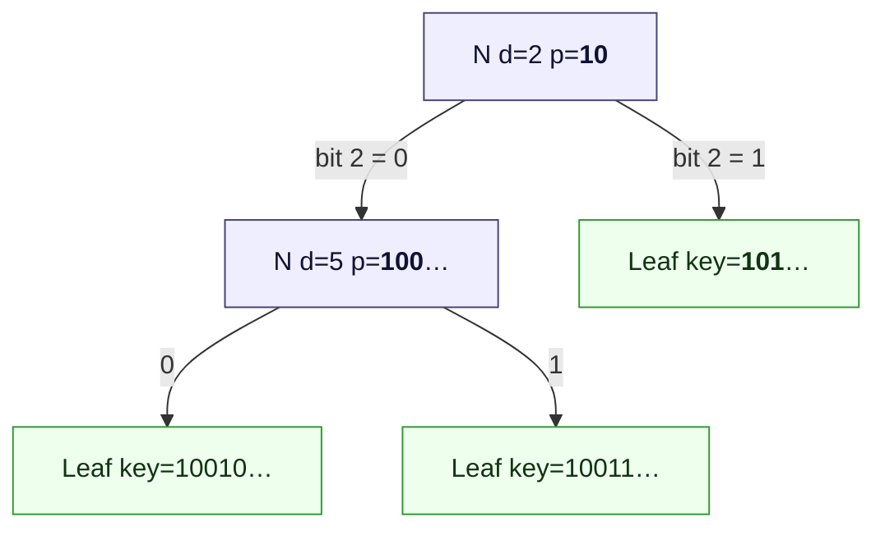
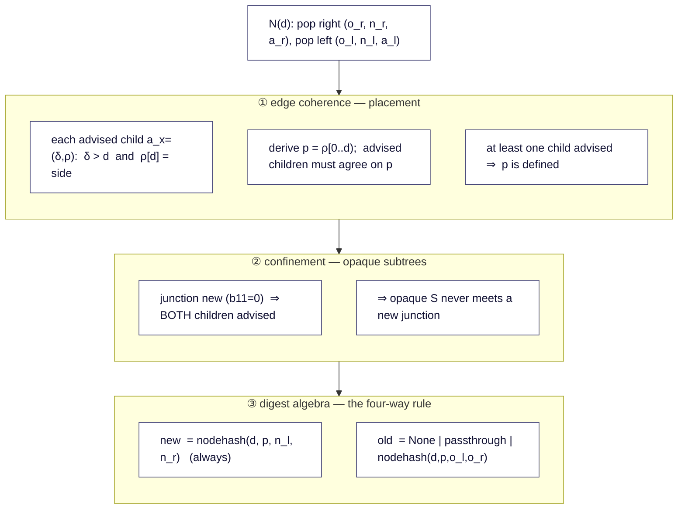
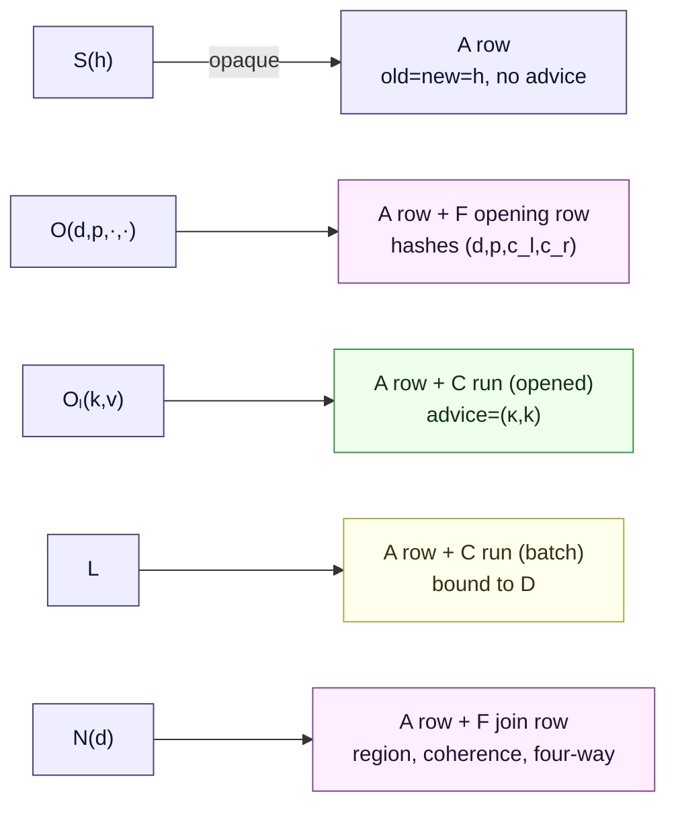
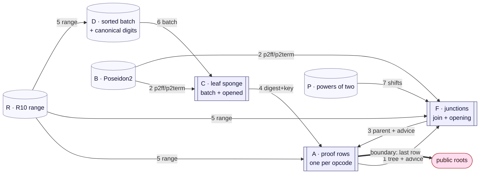
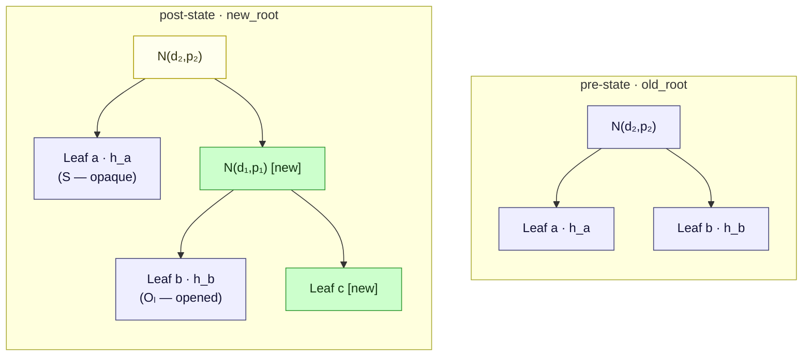
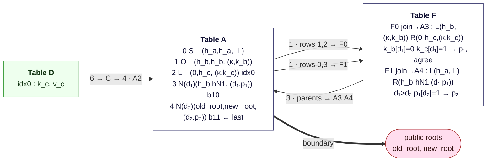

# rsmt-air

Plonky3 AIRs that **arithmetize the consistency-proof verification
algorithm** of the RSMT sparse Merkle tree -- the trusted data structure
behind the Unicity Aggregator. A single STARK binds two public 8-limb
BabyBear digests, `old_root` and `new_root`, certifying that a batch of
insertions was applied correctly between them. The batch and the
consistency-proof stream are **private** inputs; the verifier accepts on
the public roots alone.

The scope of this repository is the zk side: AIR table design, constraint
completeness, lookup-bus soundness, and prover performance. The
verification algorithm itself -- what it guarantees about the tree and why
-- is specified and proven elsewhere: the aggregation-layer paper
(Sections *Stack-Machine Verification* / *Formal Model* / *Security
Theorem*) and the executable reference `ndsmt-experiments/rsmt6a.py`.
Here it is treated as the given spec; the AIR's job is to prove that it
*was executed*, on private inputs, with the public roots as its outcome.

---

> ## ⚠️ R3 status — read this first
>
> The production arithmetization is now the **R3** seven-table set
> **`A/B/L/J/O/R/P`** (reduced A, Poseidon2 B, fused-leaf L, join J, opening O,
> range R, powers P). The M11 cut-over **removed** the legacy `A/C/D/E/F` tables
> and the old prover harness. **The detailed table sections below
> (Table A/F/C, the LogUp-bus table, the cost projection) describe the
> *superseded* pre-R3 design and are kept as background only.**
>
> The **authoritative R3 specification** lives in [`docs/r3/`](docs/r3/):
> security model, the exact relation + extraction, the append-only theorem and
> new-leaf ordering lemma, the soundness budget, the per-column influence
> manifest with the S1–S12→code map, the measured cost vs baseline, and the
> M9/M10 optimization results. What R3 adds over the old design: byte-faithful
> `Value32` leaves (S4), range-checked canonical opened regions (S5), an
> occurrence-correct permutation arena (completeness), a verifier-independent
> reduced A, a canonical protocol/decoder (`rsmt-protocol`), and a no-grinding
> FRI configuration — all proven end-to-end and adversarially validated.
>
> Prove/verify a round via
> `rsmt_prover::{prove_r3_round, verify_r3_round}`; the verifier reconstructs its
> own preprocessing from the public shape (no prover data crosses the boundary).

---

## Background: the statement being arithmetized

### The tree

RSMT is a path-compressed Patricia trie over 256-bit keys. Three node
kinds:

- **Leaf** `(key, value)` -- hashed by a 3-step additive Poseidon2 sponge.
- **Junction `N`** -- an internal bifurcation at **depth `d`** with
  **region `p`**: the `d`-bit key prefix addressing the node. Every key in
  the subtree extends `p`; `p‖0` goes left, `p‖1` goes right. Hashed by a
  2-permutation node sponge over `(DOMAIN_NODE, d, p, left, right)`.
- **Empty subtree** -- a missing branch, digest `None`.

A leaf's region is its full key; its depth is `κ = 256`. **Depth and
region are absolute**: splitting an edge *above* a node changes neither, so
inserting keys never re-hashes an existing node -- an insertion only mints
new leaf and junction hashes. This immutability is what makes the
consistency proof short.



*Every node's region is a prefix of every key beneath it; each junction's
region extends its parent's on the correct side.*

### The verification algorithm

A consistency proof is a flat **post-order** opcode stream. The reference
verifier walks it with a stack of triples `(old_digest, new_digest,
advice)`, where `advice = (depth, region)` describes the top node of a
stacked subtree (or `⊥` for an opaque one). At the end the stack must hold
exactly one triple, `(old_root, new_root, ·)`.

| Op | Meaning | Pops | Pushes |
|---|---|---|---|
| `S(h)` | opaque unchanged subtree | -- | `(h, h, ⊥)` |
| `O(d,p,c_l,c_r)` | unchanged junction, opened one level | -- | `(h, h, (d,p))`, `h = nodehash(d,p,c_l,c_r)` |
| `Oₗ(k,v)` | unchanged leaf, opened | -- | `(h, h, (κ,k))`, `h = leafhash(k,v)` |
| `L` | new leaf, next from sorted batch | -- | `(None, leafhash(k,v), (κ,k))` |
| `N(d)` | junction -- derive `p`, check coherence, join | 2 | `(old, new, (d,p))` |

Two details matter for the arithmetization:

- **`N` carries only the depth.** The region `p` is *derived* from the
  advice of the two children on the stack -- regions never travel in the
  proof stream.
- **Openings (`O`, `Oₗ`) expose the advice of preserved subtrees.** An
  opaque `S` has no advice and is only admissible under a *pre-existing*
  junction; wherever a preserved subtree meets a *new* junction, the
  prover must present its opened form.

The `N(d)` handler combines three rule families:



**③ Four-way old-state rule.** The *new* child digests always exist; the
*old* ones may be `None`. With `b00..b11` indicating which children
existed:

| `b00` | `b01` | `b10` | `b11` | `old` result | junction is |
|:-:|:-:|:-:|:-:|---|---|
| 1 | | | | `None` | new (empty→empty) |
| | 1 | | | `right.old` (passthrough) | new |
| | | 1 | | `left.old` (passthrough) | new |
| | | | 1 | `nodehash(d, p, left.old, right.old)` | pre-existing |

Only the `b11` case hashes on the old side; passthroughs keep add-only
proofs short. A junction is **pre-existing iff `b11 = 1`** -- exactly the
case where an opaque `S` child is admissible.

**Why the coherence rules exist**, in one breath: digest algebra alone
proves that hashes are preserved, but not that new leaves sit where their
keys dictate -- and a misplaced junction lets a malicious operator shadow
an existing key with a new value under a fresh certified root
(cross-round equivocation, i.e. a double-spend enabler). Rules ①-② close
this; the attack, the formal definitions, and the soundness theorems are
provided in the paper ('Unicity Bluepaper') and are reproduced executably
in `ndsmt-experiments/rsmt6a.py`. For this repository :all three rule
families are part of the statement, and the constraints must cover every
one of them.**

### Hashing

**Leaf hash** -- 3-step additive Poseidon2 sponge, rate 8 / capacity 8,
digest = `state[0..8]` after step 2. Keys and values pack as 9×30-bit
BabyBear limbs (limbs 0..7 hold 30 bits, limb 8 holds 16).

```
state ← [0;16]
step 0:  state[0]+=DOMAIN_LEAF; state[1..8]+=key[0..7];        state←P2(state)
step 1:  state[0]+=key[7]; state[1]+=key[8]; state[2..8]+=value[0..6]; state←P2(state)
step 2:  state[0..3]+=value[6..9];                            state←P2(state)
leaf_digest = state[0..8]
```

**Node hash** -- the preimage carries the region and does not fit one
width-16 permutation, so it is a **2-permutation sponge**. The key design
point: the first permutation depends only on the junction's *position*
`(d, p)`, so it is **shared** between the old-side and new-side digests of
the same junction.


Permutation budget per object:

| object | permutations | note |
|---|:-:|---|
| leaf (`L` or `Oₗ`) | 3 | sponge steps |
| new junction | 2 | prefix + one children block |
| pre-existing junction (`b11`) | 3 | prefix **shared**, + two children blocks |
| opening (`O`) | 2 | prefix + one children block |

Region limbs reuse the key packing verbatim -- a leaf's advice region *is*
its key limbs, so every region comparison operates on one uniform 9-limb
representation. Regions are stored **left-aligned and zero-padded** below
bit `d`: one canonical encoding per region.

---

## From stack machine to AIR

The prover commits two private inputs -- the proof stream (**Table A**, one
row per opcode) and the sorted batch (**Table D**) -- and the AIR proves
they flow through the hash, join, and coherence constraints to produce
Table A's final row, pinned to the public roots.

The reference machine's *stack* never appears as a table. Instead, **the
advice tuple rides the tree bus alongside the digest pair**, so each
junction sees its children's `(depth, region)` in exactly the place the
stack machine would -- and cannot pair one row's digest with another's
advice, because they travel as one tuple.

### Which table serves which opcode



Every opcode is one Table A row; four of the five are *backed* by a helper
row that does the real work and hands back a digest (+advice) over a bus.
`S` is the only self-contained opcode.

### Data flow across all tables



Reading the spine: `D → C → A(L) → F(join) → A(final) → roots`. Two side
inlets feed the pre-state: **opened leaves** enter through C (kind
*opened*, no batch binding) and **opened junctions** through F (opening
rows); opaque `S` digests enter directly on A rows.

The batch and proof stay private -- they live only in committed traces.
Verification reconstructs the AIR shapes and checks local constraints,
public roots, the preprocessed commitment, and every LogUp balance.

---

## The tables

Seven AIRs share one main commitment via `p3-batch-stark`; each is padded
independently to a power of two. "Real" = not a padding row. The three
principal tables (A, F, C) carry the statement; B, D, R, P are helpers.
(The R2 revision replaced the byte-range table **E** with the R10 range
table **R**, and folded the canonical-input checks that a separate Table I
would have carried into **D** — see the per-table notes below.)

### Table A — proof rows

One row per opcode. A one-hot selector `(is_s, is_o, is_ol, is_l, is_n)`
drives opcode-specific constraints. The **advice columns** `(has_advice,
delta, rho[9])` materialize the stack's advice tuple on every row; they are
fixed per opcode and, for the backed opcodes, *received* from the helper
that computed the digest:

| opcode | old / new | advice source | key columns |
|---|---|---|---|
| `S` | `old = new = h` (witness) | none (`⊥`) | — |
| `O` | `old = new = h` (Bus 3) | `(d, p)` from F opening | via Bus 3 |
| `Oₗ` | `old = new = h` (Bus 4) | `(κ, key)` from C opened | via Bus 4 |
| `L` | `old = 0`, `old_is_none = 1`, `new` (Bus 4) | `(κ, key)` from C batch | `batch_idx` |
| `N` | parent tuple (Bus 3) | `(d, p)` from F join | `node_hash_old_needed = b11` |

Each row also carries a **`subtree_start`** column (D19): the smallest row
index in this row's post-order subtree. Base opcodes constrain it to
`row_idx`; `N` rows inherit their left child's start (received from F on
Bus 3); the last real row (the root) constrains it to `0`. It travels on
Bus 1 and Bus 3 — see *LogUp buses* for how it proves contiguous post-order
without the old locality pointers.

**Constraints.** Selector booleanity + one-hot; per-opcode advice shape as
above; `S/O/Oₗ ⇒ old = new`; `L ⇒ old = 0 ∧ old_is_none = 1` with canonical
zeroing; base-opcode `subtree_start = row_idx`, root `subtree_start = 0`;
padding rows syntactically zero. **Boundary:** the last real row's
`(old, new)` equals `(old_root, new_root)`, and its `old_is_none` equals the
public `old_root_is_none` (17 public values — genesis `None` vs `Some[0;8]`).
**Buses:** *send* Bus 1 on every non-last real row (the row is consumed as a
child); *receive* Bus 3 on `N`/`O` rows and Bus 4 on `L`/`Oₗ` rows;
*receive* the range bus for the depth of `N`/`O` rows.

### Table F — junctions (join + opening rows)

A row-kind bit selects **join** rows (one per `N`) and **opening** rows
(one per `O`), sharing the node-sponge machinery.

**Join rows** hold both child tuples `(old[8], new[8], none)`, their advice
`(has, delta, rho[9])` received on Bus 1, the parent tuple, the case bits
`b01, b10, b11`, and the derived region `p[9]`. The two children are located
by **`subtree_start`** (D19), not a witnessed pointer: the right child is the
Bus-1 row at `parent_row_idx − 1`, the left child the row at `rs − 1` (where
`rs` is the right child's `subtree_start`, read off the bus). They enforce
all three rule families: the four-way digest algebra, and the coherence +
confinement blocks below.

**Opening rows** carry `(d′, p′[9], c_l[8], c_r[8])`, hash them through the
node sponge once, canonicalize `p′` (zero-padding below bit `d′`), and send
`(h, h, (d′, p′))` to the matching A `O` row on Bus 3. They receive no
Bus 1 children and run no four-way rule.

#### The coherence block

A child with region
`ρ` on side `β` (0 = left, 1 = right) of a junction at depth `d`, region
`p`, must satisfy `ρ[0..d) = p`, `ρ[d] = β`. Split `d` across the limbs: a
one-hot selector `q[0..9]` picks the **boundary limb** and an offset `r`
gives `d = 30·q + r` (limb 8 has width 16). Let `W` be that limb's width.
Within the boundary limb, MSB-aligned:

```
 limb q  (W bits, MSB on the left)
 ┌──────────────┬───┬───────────────────┐
 │   hi  (r b)  │ β │   lo  (W−r−1 b)    │   = ρ[q]  (the child)
 └──────────────┴───┴───────────────────┘
 │   hi  (r b)  │ 0 │        0           │   = p[q]  (the junction)
 └──────────────┴───┴───────────────────┘
   shared prefix  ▲    child-only tail
                  └ side bit forced to β
```

The R2 revision (D12/D13) proves the two range side-conditions `hi < 2^r`
and `lo < 2^{W−r−1}` by **direct radix-1024 decomposition** against Table R
(the R10 range table `{(bits,value) : 0 ≤ bits ≤ 10, value < 2^bits}`),
rather than a complement identity or a multiply-up. A value `x < 2^k` is
written `x = x₀ + 2^10·x₁ + 2^20·x₂` with `k = 10h + s`; a one-hot `u[3]`
selects the boundary digit `h`; digits below `h` are looked up as `(10, xᵢ)`,
the boundary digit as `(s, x_h)`, and digits above `h` are forced to zero.
The shared prefix `H` (the top `r` bits of the boundary limb) is decomposed
once and reused by both children, so `β = 0`/`β = 1` are constants and only
one power `pow_b = 2^{W−r−1}` is looked up (`pow_a = 2·pow_b` is derived).

Constraints per advised child (gated by `has_x`):

- **depth gap** `delta_x − d − 1 ∈ [0, 256)` as an `(8, gap)` receive on the
  range bus (⇒ `delta_x > d`);
- **whole limbs before the boundary** `rho_x[j] = p[j]` for `j < q`;
- **whole limbs after** `p[j] = 0` for `j > q` (canonical padding);
- **boundary limb** `p[q] = 2·pow_b·H`,
  `rho_x[q] = p[q] + β·pow_b + L_x`, with `L_x < 2^{W−r−1}` proved by its
  radix-1024 digits on the range bus and `pow_b` anchored to Table P (Bus 7).

Because *both* advised children constrain the **same** `p[9]` columns (via
the shared `H`), "the derived regions agree" is automatic -- no separate
equality. Two scalar rules finish the block:

- **at least one advised child:** `(1 − has_l)(1 − has_r) = 0`;
- **confinement:** `(1 − b11)(2 − has_l − has_r) = 0`.

**Node sponge (Bus 2, tagged — D17).** The prefix block
`P2(DOMAIN_NODE, d, p, 0…)` is requested **once per row** on the
feed-forward bus `p2ff` (its full 16-limb output `mid` feeds the children
blocks). The children blocks are **terminal**: they are received on `p2term`
carrying only the 8-limb digest, which is `parent_new` (always) and
`parent_old` (only when `b11`). Because the digest slot in the `p2term`
receive *is* `parent_new`/`parent_old`, the propagated node digest is bound
directly to the real Poseidon2 output — no separate output columns, and no
way to propagate a digest that wasn't hashed. Passthrough rows copy the
surviving child's old digest. Per-row permutation count: 2 (new junction /
opening) or 3 (`b11`). This is what keeps Table F at **142** columns.

### Table C — leaf sponge (batch + opened)

Three rows per leaf replay the additive sponge (steps 0/1/2, digest =
`state[0..8]`). A preprocessed kind bit distinguishes:

- **batch** leaves -- `(key, value)` received from Table D on Bus 6; digest
  sent to `L` rows.
- **opened** leaves -- `(key, value)` are Table C's own witness (they come
  from the proof stream); **no Bus 6**; digest sent to `Oₗ` rows.

Bus 4 carries `(kind, idx, digest[0..8], key[9])` -- shipping the key limbs
is what grounds the `rho = key` advice on `L` and `Oₗ` rows in the same run
that produced the digest.

### Helper tables B, D, R, P

- **B — Poseidon2.** `VectorizedPoseidon2Air<16, 7, 4, 13, 8>` with an
  8-lane preprocessed `(ff_mask, term_mask)` per lane; each lane *sends*
  twice (D17): the full `(input[16] ‖ output[16])` on **`p2ff`** at
  `ff_mask` (feed-forward perms) and `(input[16] ‖ output[0..8])` on
  **`p2term`** at `term_mask` (terminal perms). Exactly one mask is set per
  real perm. The single source of truth that every in-circuit "hash" is a
  genuine Poseidon2 evaluation.
- **D — sorted batch + canonical digits.** `(idx, key[9], value[9])` on
  Bus 6 *send*, plus preprocessed radix-1024 digits `key_d[26]`/`value_d[26]`
  with in-AIR reconstruction (`limb = Σ digit·1024ⁱ`, gated by realness) and
  a range-bus *receive* per digit. This is the R2 canonicality check (the
  role a separate Table I would have played): it pins every key/value limb to
  a byte-canonical value `< 2^30`, so a prover cannot commit non-canonical
  field limbs. The verifier consumes only the shape; sort/dedup stay external
  (see scope notes).
- **R — R10 range.** `{(bits, value) : 0 ≤ bits ≤ 10, value < 2^bits}` —
  2047 real rows + a padding row, with a multiplicity column. The single
  range bus serves depths, depth gaps, coherence digits, and the canonical
  input digits (a byte `= (8, value)` is subsumed). `mult` is locally free,
  tied to receivers by the LogUp balance.
- **P — powers of two.** 31 rows `(r, 2^r)`, `r ∈ [0,30]`; Bus 7 serves the
  coherence power `pow_b = 2^{W−r−1}`. All powers fit BabyBear (`2^30 < p`).

---

## LogUp buses

Seven logical buses (Bus 2 is realized as two — `p2ff` + `p2term`, D17),
each one extension-field aux column per AIR per tuple; per-bus challenges
`(α, β) ∈ 𝔽_{p⁴}` sampled after the main commitment.

| # | name | tuple | sender → receiver |
|:-:|---|---|---|
| 1 | `tree` | `(row_idx, subtree_start, old[8], new[8], old_is_none, has_advice, delta, rho[9])` | A non-last rows → F join children |
| 2a | `p2ff` | `(input[16], output[16])` | B feed-forward lanes → F prefix, C steps 0/1 |
| 2b | `p2term` | `(input[16], output[0..8])` | B terminal lanes → F children, C step 2 |
| 3 | `parent` | `(parent_row_idx, old[8], new[8], parent_none, depth, region[9], node_hash_old_needed, subtree_start)` | F join+opening → A `N`/`O` rows |
| 4 | `leaf` | `(kind, idx, digest[8], key[9])` | C step 2 → A `L`/`Oₗ` rows |
| 5 | `range` | `(bits, value)` | R → A depths, F gaps + digits, D input digits |
| 6 | `batch` | `(idx, key[9], value[9])` | D → C batch rows |
| 7 | `pow2` | `(r, 2^r)` | P → F coherence blocks |

Why the set closes the statement:

- **Bus 1 + `subtree_start`** ⇒ contiguous post-order tree shape: the right
  child is `parent−1`, the left child `rs−1`, and each `N` inherits its left
  child's start with the root's start pinned to `0`. Child indices strictly
  decrease and Bus 1 balance gives each non-root in-degree 1, so the parent
  relation is acyclic and spanning — a single genuine tree, proved by algebra
  with **no Poseidon fixed-point assumption** (D19). The advice fields put
  the stack machine's `(depth, region)` into the same multiset, so a junction
  cannot invent its children's advice.
- **Bus 3** binds each `N`/`O` row to exactly one F row of the right kind --
  digest, advice, *and* `subtree_start` together.
- **Bus 2 (`p2ff`/`p2term`)** forces every sponge block and leaf step to be a
  real Poseidon2; the terminal split binds each propagated node/leaf digest
  to a real permutation output without carrying its capacity tail.
- **Bus 4 + Bus 6** force each `L` to consume one batch digest and each
  batch run to consume one D row (`L.batch_idx = D.idx`), and give `L`/`Oₗ`
  their key advice from the producing run.
- **Bus 5 + Bus 7** make the region comparisons and inputs sound: depths in
  range, gaps positive, coherence digits and canonical key/value limbs
  bounded, coherence powers anchored.

The chain `Bus 6 → C → Bus 4 → A → boundary` is the proof that the private
batch actually produced the public transition. The verifier never sees it.

---

## Worked example

Insert one leaf `c` that splits the edge above `b`, into a two-leaf tree.
Honest proof: `S(h_a), Oₗ(k_b,v_b), L, N(d₁), N(d₂)`. Note `b` sits under
the *new* junction `N(d₁)`, so it is **opened**; `a` stays under the
*pre-existing* `N(d₂)` and remains an opaque `S`.



Stack-machine trace (advice shown; `p₁ = k_b[0..d₁) = k_c[0..d₁)`,
`k_b[d₁]=0`, `k_c[d₁]=1`):

```
S(h_a)        push (h_a, h_a, ⊥)                    ; opaque; legal under b11 below
Oₗ(k_b,v_b)   push (h_b, h_b, (κ,k_b))              ; opened preserved leaf
L             push (None, h_c, (κ,k_c))             ; h_c = leafhash(pop batch)
N(d₁)         children advised (required: new)      ; k_b[d₁]=0, k_c[d₁]=1
              p₁ = k_b[0..d₁) = k_c[0..d₁)          ; regions agree
              push (h_b, nodehash(d₁,p₁,h_b,h_c), (d₁,p₁))   ; old = h_b (b10)
N(d₂)         right advised: d₁>d₂, p₁[d₂]=1; p₂=p₁[0..d₂)
              old = nodehash(d₂,p₂,h_a,h_b) = old_root
              new = nodehash(d₂,p₂,h_a,hN1) = new_root
              push (old_root, new_root, (d₂,p₂))
```

Same round as AIR rows (B, C, E, P omitted):



- F0 is a **new** junction: confinement makes `b` open (`Oₗ`), so both
  children carry advice; coherence derives `p₁` from `k_b`/`k_c` and forces
  the split bit. F1 is **`b11`**, so the opaque `S(h_a)` on its left is
  legal, and `p₂` is grounded by chaining the old side to `old_root`.
- The zk verifier sees only the two public roots; the bus chain ties D's
  private `(k_c, v_c)` to the boundary on A row 4.

---

## Security of the arithmetization

The security question *of this repository* is faithfulness:

> A STARK proof verifies **iff** there exist private inputs `(π, B)` on
> which the reference verifier accepts `(π, old_root, new_root, B)`.

Soundness is the ⇒ direction: any committed traces satisfying every local
constraint and every LogUp balance encode an accepting run. Completeness
is the ⇐ direction: the witness generator turns every accepting run into a
satisfiable trace. What an accepting run *means* for the tree (append-only
consistency, unicity, ...) is the paper's theorem, consumed here as given.

### Assumptions

1. **STARK layer.** `p3-uni-stark` quotient evaluation + `TwoAdicFriPcs`
   low-degree test + Fiat–Shamir compose to a sound argument of knowledge
   (~116 conjectured bits at the default config).
2. **LogUp.** Per-bus challenges in `𝔽_{p⁴}` (`≈2^124`), sampled after the
   main commitment: multiset error `≤ Σ padded_height / |𝔽_{p⁴}|`, below
   `2^-100` in the parameter range used here.
3. **Upstream Poseidon2 AIR.** `p3-poseidon2-air`'s constraints accept
   exactly genuine Poseidon2(BabyBear, width 16) evaluations per lane.
4. **Public statement.** The verifier knows `(old_root, new_root)` and
   every AIR shape; shapes fix all preprocessed columns except Table D's,
   whose commitment is prover-supplied and transcript-bound.

Notably, hash *collision resistance* is not on this list -- the
arithmetization is faithful regardless; collision resistance enters one
level up, where the paper interprets accepting runs as tree facts. (Since
D19, the tree-shape argument no longer borrows a Poseidon fixed-point
assumption either — see the functional-graph note under *pitfalls*.)

### Rule-by-rule constraint coverage

Every rule of the reference verifier (`rsmt6a.verify_consistency`) must be
covered by a constraint or a bus balance -- this table is the checklist:

| reference-verifier rule | AIR mechanism |
|---|---|
| `S(c)` pushes `(c, c, ⊥)` | A: `is_s ⇒ old = new`, no-advice shape |
| `O` hashes its opening | F opening row: node sponge on Bus 2; digest + `(d′,p′)` returned on Bus 3 |
| `Oₗ` / `L` hash a leaf | C sponge steps (init, rate additions, continuity) + Bus 2; digest + key on Bus 4 |
| `L` consumes next batch element | Bus 6 (`D → C`) + Bus 4 (`C → A`) ⇒ `L.batch_idx = D.idx`, each D row consumed once |
| `N` pops two children | Bus 1 multiset (each non-last A row consumed exactly once) + `subtree_start` chain (right = `parent−1`, left = `rs−1`, root start `0`) ⇒ contiguous post-order shape |
| advice is what the child pushed | advice fields ride Bus 1/3/4 *with* the digest -- no mix-and-match |
| `δ > d` per advised child | depth-gap `(8, gap)` receive on the range bus |
| `ρ[d] = β` per advised child | boundary-limb R10 decomposition (Table P power + Table R digits) |
| key/value limbs are byte-canonical | Table D radix-1024 digit reconstruction + range-bus receives (`< 2^30`) |
| `p = ρ[0..d)`, children agree | both children constrain the same `p[9]` columns |
| `p` defined (≥1 advised) | `(1 − has_l)(1 − has_r) = 0` |
| new junction ⇒ both advised | `(1 − b11)(2 − has_l − has_r) = 0` |
| four-way old-state rule | F local case constraints + Bus 2 for the `b11` hash |
| `new = nodehash(d, p, n_l, n_r)` | prefix + children blocks on Bus 2 |
| stack ends with one entry | boundary on the unique `is_last_real` row; every other real row sent on Bus 1 and consumed |
| final entry = `(old_root, new_root)` | boundary constraints against public values |
| proof + batch fully consumed | bus balances: unconsumed sends / receives unbalance LogUp |
| batch strictly sorted, keys distinct | **not in-circuit** -- see scope notes |

### Arithmetization pitfalls (why the non-obvious constraints exist)

These are the spots where a missing constraint would break soundness even
though the "happy path" works -- each is a required negative test:

- **Digest truncation (tagged Bus 2).** A digest is 8 of 16 permutation
  output limbs. A *feed-forward* output (a node prefix, a non-final leaf
  step) is another block's input, so its full 16 limbs must be bound —
  carried on `p2ff`. A *terminal* output is used only as a digest, so it is
  carried on `p2term` as 8 limbs and the digest slot is the very column that
  propagates (`parent_new`/`parent_old`, or the leaf digest). Splitting the
  bus (rather than masking a tail) keeps every tuple degree 1 and leaves no
  unbound tail that could satisfy the bus without a permutation behind it.
- **Advice–digest co-travel.** If advice moved on its own bus, a prover
  could pair row X's digest with row Y's advice. One tuple per bus, digest
  and advice together, everywhere (Buses 1, 3, 4).
- **Padding hygiene.** Padding rows must be syntactically zero (and Table
  B's padding lanes are real `P2([0;16])` evaluations with bus
  multiplicity masked to zero) -- otherwise padding contributes spurious
  bus sends.
- **One-hot selectors.** Opcode and case bits must be boolean *and*
  mutually exclusive; a row that is "half `L`, half `N`" bypasses both
  rule sets.
- **Unique sender keys.** Bus 1 soundness leans on `row_idx` being a
  preprocessed (verifier-fixed) column: multiset balance + unique keys ⇒
  each row consumed exactly once. Same pattern for C's `leaf_idx`.
- **Canonical region encoding.** Regions must be zero-padded below bit
  `d` wherever they enter a hash (join rows by the coherence block,
  opening rows by an explicit padding check) -- two encodings of one
  region would break digest determinism.
- **Canonical inputs.** Key/value field limbs must be range-checked to their
  byte widths (`< 2^30`, top limb `< 2^16`) via Table D's digit
  reconstruction — otherwise a prover commits a non-canonical field limb that
  still hashes, forging a leaf preimage that no byte-encoded key produces.
- **Range side-conditions.** `L`, `H` of the boundary-limb R10 split must be
  range-bounded or the decomposition is ambiguous; depths must be bytes or
  the one-hot/offset split of `d` is ambiguous.
- **Functional-graph corner (closed by D19).** With the old free `left_ptr`,
  Bus 1 closure made the parent-child structure a functional graph with one
  sink, but a disjoint cycle whose digests happen to close under the buses
  was not excluded *syntactically* — it needed a Poseidon2 fixed-point to be
  ruled out. The `subtree_start` chain now excludes it algebraically: child
  indices strictly decrease (right = `parent−1`, left = `rs−1`) so the parent
  relation is acyclic, and the root's start `= 0` forces a single spanning
  tree. No cryptographic assumption is borrowed here anymore.

### Trace-tamper test matrix

Constraint coverage is only believable with negative tests. Each test
perturbs a *verifying* trace post-build and asserts proving or verification
fails (a violated constraint surfaces as a prover-side `check_constraints`
panic or a `verify_batch` error — either is a rejection). Two layers exist:
the per-table `check_constraints` negatives in `rsmt-air`, and the
end-to-end sweep in `rsmt-prover::tamper` (M5), which runs a full round
through `prove_batch`/`verify_batch`. Together they touch every bus and
every local constraint family:

| family | tamper |
|---|---|
| tree shape (D19) | swap children; corrupt a base row's `subtree_start`; corrupt a join's `ls`/`rs` |
| digest algebra | break a passthrough; forge `old_is_none`; scramble an A digest; forge `parent_new` (bound by `p2term`); tamper a feed-forward `mid` limb |
| coherence | flip a bit of derived `p`; flip advice `rho` in transit; `δ ≤ d`; out-of-range `L`/`H` digits; break `p`'s zero-padding; drop advice under a new junction (the reference shadow-insertion vector) |
| inputs | non-canonical key/value limb (Table D digit reconstruction / range) |
| kind/advice binding | opened digest consumed by `L`; batch digest consumed by `Oₗ`; one row's digest with another's advice |
| helpers | inflate a Table R (range) multiplicity; inflate a Table P (pow2) multiplicity |

### Scope notes

- **Tree-level meaning** of an accepting run -- append-only consistency,
  canonical placement, unicity across rounds -- is proven in the
  aggregation-layer paper and exercised in `ndsmt-experiments/rsmt6a.py`.
  This repo inherits, and must not weaken, the statement; it adds nothing
  to it.
- **Batch sortedness / distinctness** is not checked in-circuit. It is
  provably redundant for soundness (duplicate keys make the coherence
  constraints unsatisfiable; sort order only fixes the prover's own
  assignment of batch rows to `L` positions) -- external sort/dedup is a
  completeness convenience of the witness generator.
- **Empty pre-state / empty batch.** Genesis pins the canonical `None`
  digest at the boundary; the empty-batch identity transition is handled
  by the caller, not this AIR.
- **Zero-knowledge.** The default FRI config is succinct but not zk:
  private inputs live in unmasked committed traces. For zk, use
  `FriParameters::new_benchmark_zk` with masking columns -- out of scope
  (the goal is verifier work reduction, not input privacy).

---

## Cost projection

Table B (Poseidon2) dominates cell count — its per-row main width (≈2384 =
`P2_PERM_WIDTH × 8` lanes) is the arithmetic cost of a genuine permutation
and dwarfs every logical table (the widest of those is F at **142**). Against
a depth-only structural circuit, the coherent statement adds: one shared
prefix permutation per junction, one children block per opening, opened-leaf
sponges at split edges, and the narrow-column advice/coherence blocks. For a
fresh batch of `B` leaves into a large prefilled tree -- ≈`B` new junctions
and ≈`B` split-edge openings -- committed cells grow ~linearly in `B` (the
`rsmt-bench perf` sweep confirms this), comfortably within the headroom above
the 10⁴ tx/s design target on a single CPU. Run `rsmt-bench round` for the
exact per-table breakdown at a given batch/prefill/hash.

---

## Performance harness

`rsmt-bench` runs prove + verify across batch sizes and FRI parameters,
reporting per-table cell counts and timings.

```bash
cargo build --workspace --release
./target/release/rsmt-bench perf --prefill 100000 --batches 256,1024
```

`perf` flags: `--batches`, `--prefill`, `--seed`, `--log-blowup` (FRI LDE
rate), `--num-queries`, `--query-pow-bits` (grinding), `--max-log-arity`
(FRI folding), `--hash` (`poseidon2` / `sha256` / `blake3` / `all`). The
header prints conjectured soundness bits per the ethSTARK heuristic
`log_blowup × num_queries + query_pow_bits` (~116 at defaults).

Output columns:

```
batch  L  N  B_perms  cells  maxW  wit_ms  prove_ms  verify_ms  proof_KB
```

Other subcommands: `smt` (pure-CPU verify, no STARK) and `round` (a single
measured round with the full per-table real/padded/main/prep/cells
breakdown, timings, and proof size).

### Proving-hash selection

The FRI/Merkle/Fiat–Shamir layer hashes internally, independent of the
in-circuit tree hash (always Poseidon2). Use `poseidon2` when the proof
will be recursively verified in a field-friendly circuit (e.g. the SP1
aggregation of the paper); use `sha256`/`blake3` for a fast final native
verify. On the structural predecessor, Blake3 FRI gave ~3× faster verify
at equal prove time -- the same trade is expected here.
