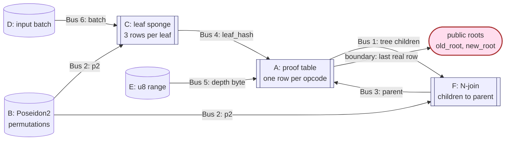
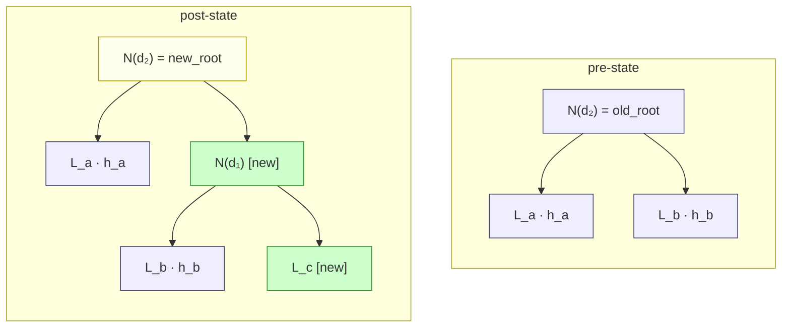
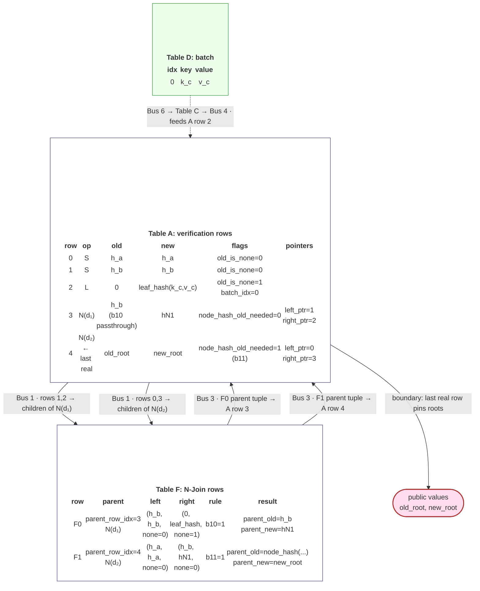
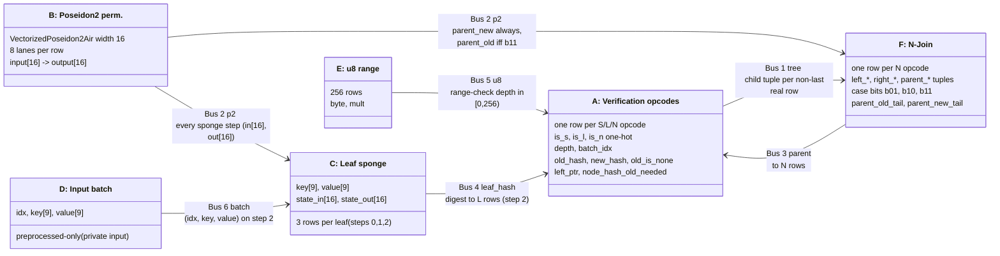
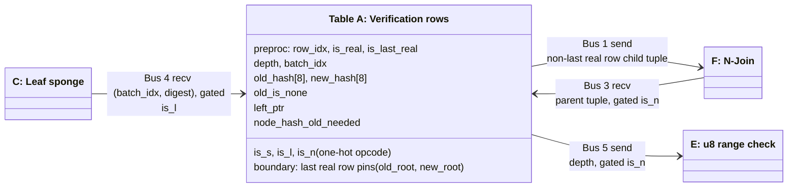
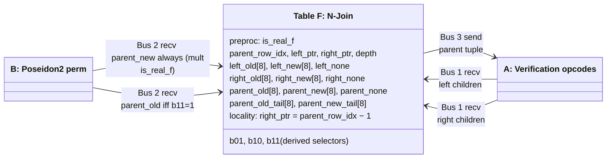
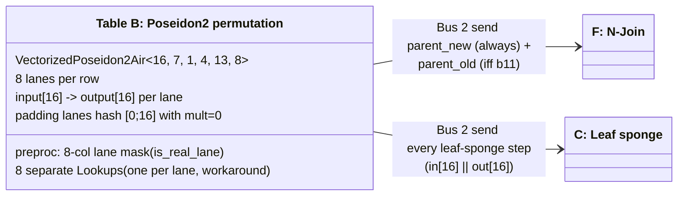
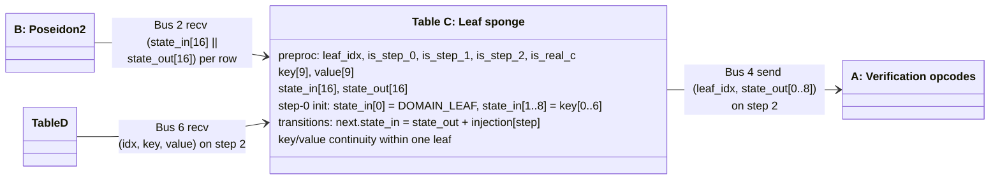
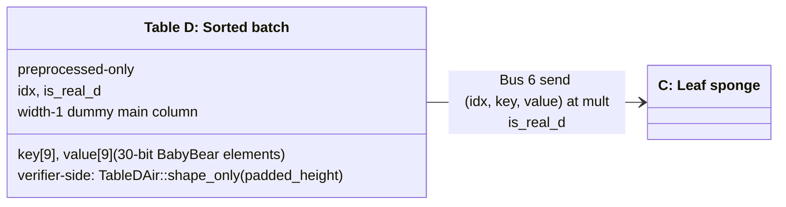
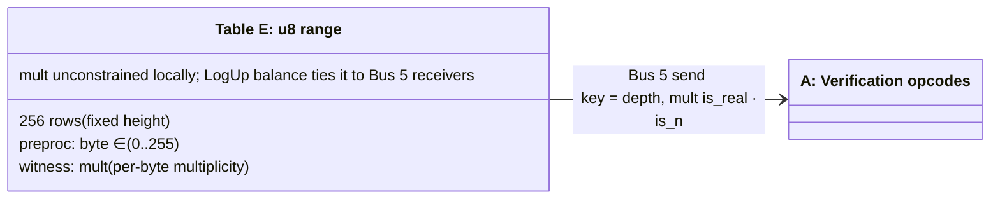

# rsmt-air

Plonky3 AIRs that prove correctness of a batch of insertions into the
RSMT3 sparse Merkle tree. (ie, the Unicity Oracle of the Aggregator machine)
The proof binds two public 8-element BabyBear digests
-- `old_root` and `new_root`; certifying that the state transition from old
to new root was executed correctly. The batch of new leaves and the
consistency proof itself are private inputs, and not needed for verification.

For an in-depth specification see [`rsmt-air.md`](rsmt-air.md).

---

## The tree being proven

RSMT3 is a path-compressed Patricia trie over 256-bit keys (sentinel-encoded
as `BigUint`). There are three kinds of nodes:

- **Leaf** -- `(key, value)`, hashed by an additive Poseidon2 sponge.
- **Junction (`N`)** -- internal bifurcation at some depth `d`, with two
  children. Hashed as `Poseidon2(left[8] || right[8])` after adding
  `DOMAIN_NODE` into limb 0 and the bifurcation depth into limb 1.
  This is one Poseidon2 permutation only; no sponge.
- **Empty subtree** -- a missing branch, denoted by the digest `None`.

Keys are inserted in pre-sorted order. A *consistency proof* is a flat
**post-order opcode stream** describing how to rebuild both the pre-state and
post-state roots from the batch. There are three opcodes:

| Op | Meaning | Stack effect |
|---|---|---|
| `S(h)` | unchanged subtree, digest `h` | push `(h, h)` |
| `L` | new leaf -- pop next sorted batch element | push `(None, leaf_hash(k,v))` |
| `N(d)` | junction at depth `d` -- pops two children | push `(node_hash(old_l, old_r, d), node_hash(new_l, new_r, d))` if both children existed before, else handles the four-way pass-through rule |

Reference verification algorithm is expressed as a stack machine: walk
the opcode stream, and at the end
there must be exactly one entry in the stack, `(old_root, new_root)`.

### Four-way old-state rule on `N`

A junction's *new* child digests always exist (every leaf is fresh). Its
*old* child digests may not -- one or both children may have been empty. Let
`b00, b01, b10, b11` be the indicators of the four cases:

| `b00` | `b01` | `b10` | `b11` | parent's old-state |
|---|---|---|---|---|
| 1 | 0 | 0 | 0 | `None` |
| 0 | 1 | 0 | 0 | `right.old` (passthrough) |
| 0 | 0 | 1 | 0 | `left.old` (passthrough) |
| 0 | 0 | 0 | 1 | `node_hash(left.old, right.old, depth)` |

This is the main rule of the consistency-proof verifier, for junctions in the stream,
enforced by the AIR tables.

---

## From stack based verifier to AIR table generation

The AIR design can be approached through the data flow. The prover
has two private inputs:

- the consistency proof, materialized as Table A ("proof table"), one row
  per `S` / `L` / `N` opcode;
- the sorted insertion batch, materialized as Table D.

The verifier sees only public values `(old_root, new_root)`. The purpose of
the AIR is to prove that the private proof table and private batch flow
through the hash and join constraints to produce the final real row of
Table A, and that this final row is exactly the public root pair.

### Table A (proof table)

Table A is the proof table. It contains the opcode stream in row order and
records, for every row, the old-state digest, the new-state digest, and an
`old_is_none` bit. Its preprocessed columns are `row_idx`, `is_real`, and
`is_last_real`; its witness columns are:

- `is_s, is_l, is_n`: one-active opcode selector;
- `old_hash[8], new_hash[8], old_is_none`: hash computation progress at this point;
- `batch_idx`: meaningful only on `L` rows;
- `depth, left_ptr, node_hash_old_needed`: meaningful only on `N` rows.

The three opcode types are processed by table A as follows:

- `S(h)` is an unchanged subtree: `old_hash = new_hash = h` and
  `old_is_none = 0`.
- `L` is a fresh inserted leaf: `old_hash = 0`, `old_is_none = 1`, and
  `new_hash` must be the leaf-sponge final digest for `batch_idx`.
- `N(depth)` is a junction result: Table A stores only the parent tuple and
  metadata. The child tuples, four-way old-state rule, and node hashes are
  checked in Table F and linked back to this row.

Every non-last Table A row sends
`(row_idx, old_hash, new_hash, old_is_none)` on the `tree` bus. Every
junction consumes two such rows in Table F. The last real Table A row does
not send on `tree`; it is the output row, and boundary constraints pin
`(old_hash, new_hash)` to the public `(old_root, new_root)`.

`left_ptr` is witness metadata that identifies the left child row for an
`N`; the right child is constrained in Table F by
`right_ptr = parent_row_idx - 1`. The current witness builder derives these
pointers by walking the post-order proof, but that is only a helper for
constructing rows. The AIR statement is the table/bus relation itself:
every non-root proof row is consumed exactly once as a child, and the final
proof row is the root.

### Hashing

All Poseidon2 permutations are checked by Table B. Other tables
request full permutation tuples
`(input[16], output[16])` through the `p2` bus, and Table B sends exactly
the committed permutation lanes checked by `VectorizedPoseidon2Air`.

Leaf data to be hashed is longer than one permutation input, thus a
sponge compression function is used; compression steps controlled by Table C.
For each batch row it runs the following sponge absorption steps:

1. start from zero state, add `DOMAIN_LEAF` and `key[0..7]`, then run
   Poseidon2 permutation;
2. add `key[7..9]` and `value[0..6]`, then run Poseidon2 permutation;
3. add `value[6..9]`, then run Poseidon2 permutation.

Table C keeps the full 16-element sponge state for each step. The final digest
is `state_out[0..8]` on step 2, sent to the matching `L` row in Table A on
the `leaf_hash` bus. Table D supplies `(idx, key[9], value[9])` to Table C
on the `batch` bus, so a Table A leaf row cannot use a digest that was not
computed from the private batch.

Internal tree node hashes are controlled by Table F. For each `N` row it receives the
left and right child tuples from Table A, applies the four-way old-state
rule, and requests Poseidon2 permutation from Table B:

- `parent_new = H_node(left_new, right_new, depth)` is always requested;
- `parent_old = H_node(left_old, right_old, depth)` is requested only when
  both old children exist (`b11 = 1`);
- pass-through cases do not request an old node hash.

A node-hash input is `left[8] || right[8]` with `DOMAIN_NODE` added to
element 0 and `depth` added to element 1. The digest is the first 8 output elements.
Table F also stores the bottom 8 output elements (`parent_*_tail`) so the
lookup tuple matches Table B's full 16-element output; otherwise only the
truncated digest would be tied to Poseidon2.

### Entire data flow

The arrows below are LogUp multiset equalities:



We can see sort of data flow:

`D batch row -> C leaf digest -> A L row -> F junction rows -> A final row -> public roots`


The batch and proof stay private because they appear only in committed
traces. Verification reconstructs the AIR shapes and checks the proof,
public values, global preprocessed commitment, local constraints, and
LogUp balances.

### Constraints checking

Table A constraints make each proof row well-formed:

- opcode selectors are boolean and one-active;
- `S` rows are unchanged subtrees;
- `L` rows are fresh leaves with canonical zero old hash;
- `N` rows do not carry a batch index;
- `old_is_none` implies `old_hash = 0`;
- padding rows are zero;
- the last 'real' (not padding) row equals the public roots;
- buses fire only on the rows where the corresponding value is meaningful.

Table F constraints make each junction row well-formed:

- left/right/parent none bits and case bits are boolean;
- `b01`, `b10`, `b11`, and `parent_none` are fixed by the child none bits;
- pass-through old-state cases copy the passing old-child digest;
- full (with both children) old-state cases require an old node hash through Bus 2;
- `right_ptr = parent_row_idx - 1` preserves the local post-order shape;
- the parent tuple sent back to Table A includes `depth` and
  `node_hash_old_needed`, so Table A's `N` row cannot detach from the
  join rule that produced it.

Tables B, C, D, and E provide the helper constraints around Table A and F:
Table B proves the Poseidon2 permutations, Table C proves the leaf-sponge
state transitions, Table D supplies the private input batch (sorted), and Table E
range-checks every junction depth.

### Example

Consider the consistency proof:

`S(h_a), S(h_b), L(L_c), N(d₁), N(d₂)`

for the single-element batch `B = {(k, v)}`,

with derived hashes
`hN1 = node_hash(h_b, leaf_hash(k_c, v_c), d₁)` and
`new_root = node_hash(h_a, hN1, d₂)`.

The trees look like this:


For reference, the verification using a stack machine would compute like this:

```
S(h_a)   push (h_a, h_a)           ; sibling with unchanged subtree (pre = post)
S(h_b)   push (h_b, h_b)           ; sigling with unchanged subtree
L        h_c <- leaf_hash(pop(B))  ; pop leaf from sorted batch, hash it
         push (Null, h_c)          ; prev. must be Null for every new leaf
N(d₁)    Null, h_c = pop           ; pop right sibling, depth is given
         h_b, h_b = pop            ; pop left sibling
         h_b = resolve_old_state(Null, h_b, d₁)  ; pass-through rule, one sibling
         hN1 <- node_hash(h_b, h_c, d₁)          ; after - always both siblings
         push (h_b, hN1)
N(d₂)    h_b, hN1 = pop
         h_a, h_a = pop
         h0 <- resolve_old_state(h_a, h_b, d₂)   ; no pass-through, both siblings
         h1 <- node_hash(h_a, hN1, d₂)
         push (h0, h1)             ; push result (h0=old_root, h1=new_root)
```

In the case of AIR arithmetization, the resulting witness for the same batch and proof, instantiated as Tables A, F, D, look like this: (each table row below is one
real row; arrows are LogUp bus sends/receives, Tables B, C, E omitted):



- Bus 1 multiset: each of rows 0, 1, 2, 3 is consumed exactly once as a
  child by exactly one F row. Row 4 is the last real row, hence does not
  send Bus 1 -- it is consumed by the boundary rule instead.
- Row 3 illustrates **`b10` passthrough**: `right` was `None`, so
  `parent_old = left.old = h_b`; no Bus 2 receive of an old hash and
  `node_hash_old_needed = 0`.
- Row 4 illustrates **`b11` full hash**: both children existed in the
  old tree, so Table F receives Bus 2 *twice* for this row (once for
  `parent_new`, once for `parent_old`), and `node_hash_old_needed = 1`.
- Bus 5 (range-check `depth ∈ [0, 256)`) constrained on rows 3 and 4.
- The verifier never sees `k_c, v_c, h_a, h_b, hN1` -- only the two
  public roots; the bus chain ties the private batch row in Table D to
  the public boundary on Table A row 4.

## The AIR tables

All six AIRs share a single main commitment via `p3-batch-stark`. Each is
padded independently to a power of two rows, "real" means not a padding row.




### Table A: Verification rows

> *Replays the verifier's opcode stream, one row per opcode.*

One row per `S/L/N` opcode. A one-active selector (`is_s, is_l, is_n`) drives
opcode-specific constraints: `S` rows must satisfy `old_hash = new_hash`
(unchanged subtree); `L` rows must have `old_hash = 0` and `old_is_none = 1`
(fresh leaf); `N` rows carry `depth`, `left_ptr`, and a single bit
`node_hash_old_needed` indicating whether the parent's old digest came from
the four-way rule's `b11` branch. Boundary constraints on the *last real*
row pin `(old_hash, new_hash) = (public_old_root, public_new_root)`.

**Constraints**
- Boolean-ness and one-active of opcode selectors.
- `S -> old = new`; `L -> old = 0 ∧ old_is_none = 1`; canonical zeroing
  `old_is_none · old_hash[j] = 0`.
- Padding-row syntactic zero: `(1 − is_real) · column[j] = 0` for every
  witness column.
- Boundary: last real row's digests equal the public roots.
- Bus 1 *send* on every non-last real row (consume by some F row).
- Bus 3 *receive* on `N` rows (parent digest comes from F).
- Bus 4 *receive* on `L` rows (digest comes from C step 2).
- Bus 5 *send* on `N` rows (range-check `depth ∈ [0, 256)`).



### Table F: N-Join

> *One row per junction (`N`) opcode, holding both child tuples and the
> parent tuple side-by-side so the four-way old-state rule is a local
> constraint.*

Each row carries 17 columns of `(left_old[8], left_new[8], left_none)`,
17 of `(right_old, right_new, right_none)`, 17 of parent, plus the three
explicit case bits `b01, b10, b11` and the bottom-8 outputs of the parent's
node-hash Poseidon2 evaluations (`parent_old_tail[8]`,
`parent_new_tail[8]`).

**Constraints**
- Boolean-ness of all none-bits and case-bits; `b01, b10, b11` algebraically
  fixed to the products of the none-bits.
- `parent_none = left_none · right_none`.
- **Four-way pass-through rule**: `(1 − b11) · parent_old[j] = b01 ·
  right_old[j] + b10 · left_old[j]` for `j = 0..7`.
- Tail canonical zeroing: `(1 − b11) · parent_old_tail[j] = 0` --
  pass-through rows do not receive an old hash through Bus 2, so the tail must not
  carry smuggled values.
- Locality: `right_ptr = parent_row_idx − 1`.
- Padding rows are zero.
- Bus 1 *receive* twice per row (left and right children).
- Bus 2 *receive* for `parent_new` always; for `parent_old` only when
  `b11 = 1`.
- Bus 3 *send* of the parent tuple to Table A.



### Table B: Poseidon2 permutation

> *Every Poseidon2 evaluation needed anywhere in the proof -- leaf hash
> sponge permutations and junction node hash permutations.*

Built directly from `p3-poseidon2-air::VectorizedPoseidon2Air<WIDTH=16,
SBOX_DEGREE=7, HALF_FULL_ROUNDS=4, PARTIAL_ROUNDS=13, VECTOR_LEN=8>`. The
inner constraints (provided by Plonky3) check that each lane is a real
Poseidon2(BabyBear, width 16) evaluation. The rsmt layer adds only an
8-column preprocessed lane mask: padded lanes are still real evaluations of
`[0; 16]` (so the inner constraints hold), but their Bus 2 *send*
multiplicity is masked to zero.

**Constraints**
- Plonky3 internal: each row encodes one valid Poseidon2 permutation.
- Per-lane Bus 2 *send* of `(input[16] || output[16])` at multiplicity
  `is_real_lane[lane]`. Eight separate `Lookup`s (one per lane); rsmt-air
  uses one tuple per `register_lookup` call so each tuple gets its own aux
  column set.



### Table C: Leaf sponge controller

> *Three rows per leaf, replaying the sponge state evolution and
> squeezing out the leaf digest.*

Preprocessed columns `leaf_idx, is_step_0, is_step_1, is_step_2, is_real_c`
hard-wire the row layout `[0,0,0, 1,1,1, 2,2,2, …]` once `B` is known, so
each `leaf_idx` automatically gets exactly one `is_step_2` row. Witness
columns hold `key[9], value[9], state_in[16], state_out[16]`.

**Constraints**
- Step-0 initialization: `state_in[0] = DOMAIN_LEAF`, `state_in[1+j] =
  key[j]` for `j = 0..6`, `state_in[8..16] = 0`.
- Step transitions (gated by next-row's preprocessed indicator): `next.
  state_in[j] = local.state_out[j] + injection[step][j]`
- Key/value continuity within one leaf.
- Padding is zeroed.
- Bus 2 *receive* of `(state_in[16] || state_out[16])` per real row.
- Bus 4 *send* of `(leaf_idx, state_out[0..8])` on step 2 only.
- Bus 6 *receive* of `(leaf_idx, key[9], value[9])` on step 2 only.



### Table D: Sorted batch (preprocessed-only)

Width 1 dummy main column (Plonky3 batch-STARK requires a non-empty main
trace per instance). Preprocessed: `idx, is_real_d, key[9], value[9]`. The
prover sorts and packs into 30-bit elements the batch *before* materializing this
trace -- the 30-bit split is inherited by construction; no in-circuit
bit decomposition.

**Constraints**
- Bus 6 *send* of `(idx, key[9], value[9])` at multiplicity `is_real_d`.

The verifier constructs Table D via `TableDAir::shape_only(padded_height)`
(no batch data); the prover-side preprocessed commitment lands in
`prover_data.common.preprocessed`, transcript-bound to the rest of the
proof.



### Table E: `u8` range check

> *256 rows of bytes; multiplicities count each `depth ∈ [0, 256)`.*

Preprocessed: 1 column `byte ∈ {0, 1, …, 255}`. Witness: 1 column `mult`,
unconstrained locally -- LogUp's multiset balance on Bus 5 enforces that
`mult[b]` equals the number of N rows in Table A with `depth = b`.



---

## LogUp buses

Six global buses (`Kind::Global(name)`), each with one extension-field
auxiliary column per AIR. Per-bus challenges `(α, β) ∈ EF = BabyBear^4` are
sampled after producing the main commitment.

| # | Name | Tuple | Sender | Receiver |
|---|---|---|---|---|
| 1 | `tree` | `(row_idx, old_hash[8], new_hash[8], old_is_none)` | A non-last real rows | F left + F right |
| 2 | `p2` | `(input[16], output[16])` | B per real lane | F new (always) + F old (when `b11`) + C real rows |
| 3 | `parent` | `(parent_row_idx, parent_old[8], parent_new[8], parent_none, depth, node_hash_old_needed)` | F | A `N` rows |
| 4 | `leaf_hash` | `(batch_idx, digest[0..8])` | C step 2 | A `L` rows |
| 5 | `u8` | `(byte)` | E | A `N` rows (key = `depth`) |
| 6 | `batch` | `(idx, key[0..9], value[0..9])` | D | C step 2 |

Why this set is sufficient (intuitively):
- **Bus 1** + `right_ptr = parent_row_idx − 1` ~ "post-order tree shape".
- **Bus 3** binds each `N` row in Table A to exactly one row in Table F.
- **Bus 2** forces every node-hash and every leaf-sponge step to be a real
  Poseidon2 evaluation.
- **Bus 4** + **Bus 6** force every `L` row to consume one final-step digest
  and every final step to consume one batch row -> `L.batch_idx = D.idx`.
- **Bus 5** range-checks `depth ∈ [0, 256)`.

The chain `Bus 6 -> C -> Bus 4 -> A -> boundary` is the proof that the
prover-supplied private batch was actually used to produce the public root
transition. The verifier never sees the batch.

---

## Performance harness

The `rsmt-bench` binary runs prove + verify across configurable batch sizes
and FRI parameters, reporting per-table cell counts and timings.

```bash
cargo build --workspace --release
./target/release/rsmt-bench perf [FLAGS]

# Example: pre-insert 100,000 random leaves, then prove fresh batches of 256 and 1024 leaves.
./target/release/rsmt-bench perf --prefill 100000 --batches 256,1024
```

### `perf` subcommand flags

| Flag | Default | Meaning |
|---|---|---|
| `--batches` | `16,64,256` | Comma-separated list of batch sizes to sweep. |
| `--prefill` | `0` | Pre-insert this many random leaves into the tree before generating each measured batch proof. |
| `--seed` | `0` | RNG seed for batch + Fiat–Shamir (deterministic). |
| `--log-blowup` | `1` | FRI Low Degree Extension rate, `log_2(blowup)`. Larger results with bigger LDE on the prover, but each query is worth more soundness bits. |
| `--num-queries` | `100` | Number of FRI query rounds. Linear in proof size and verifier work. |
| `--query-pow-bits` | `16` | Grinding bits before sampling queries. Adds prover work; reduces queries needed for the same soundness. |
| `--max-log-arity` | `3` | Max FRI folding arity (`log_2`). 1 = binary folding. |
| `--hash` | `poseidon2` | Hash function used internally by the prover: `poseidon2` / `sha256` / `blake3` |

The header line prints the resulting **conjectured soundness bits** according to
the ethSTARK heuristic: `log_blowup × num_queries + query_pow_bits`. The
defaults give ~116 bits. It also prints `prefill=N` so runs against an empty
tree and runs against an existing tree are easy to distinguish.

Output columns:

```
batch  L_ops  N_ops  B_perms  cells  wit_ms  trace_ms  prove_ms  verify_ms  proof_KB
```

Per-table breakdown follows: real rows / padded height / main width +
preprocessed width / total cells.

### Other subcommands

- `smt --prefill N --batch B` -- pure CPU consistency-proof verify (no STARK).
- `poseidon2 --num-hashes K` -- standalone Poseidon2 FRI proof.
- `table-a --batch B`, `table-f --batch B` -- single-AIR FRI prove/verify.
- `batch --batch B` -- full six-AIR `prove_batch` (no metrics).

---

## Example results

Hardware: Apple M1 "pro", release build, `parallel` feature on.
All runs at ~116-bit conjectured soundness, using poseidon2 internally

### Default config (`log_blowup=1, num_queries=100, pow=16`)

| batch | L_ops | N_ops | B_perms | cells | wit_ms | trace_ms | prove_ms | verify_ms | proof_KB |
|---:|---:|---:|---:|---:|---:|---:|---:|---:|---:|
| 4096 | 4096 | 4095 | 16383 |  6.4M | 20 | 4 | 143 | 45 | 1759.6 |
| 8192 | 8192 | 8191 | 32767 | 12.8M | 37 | 5 | 228 | 47 | 1816.9 |

### Reduced proof size (`log_blowup=2, num_queries=50, pow=16`)

| batch | wit_ms | trace_ms | prove_ms | verify_ms | proof_KB |
|---:|---:|---:|---:|---:|---:|
| 4096 | 19 | 2 | 198 | 24 |  928.5 |
| 8192 | 38 | 7 | 378 | 25 |  959.3 |

Effect: zk proof size shrinks to half, prove time roughly doubles, verify time
**halves** (fewer queries to open). Soundness unchanged.

### More PoW (`log_blowup=1, num_queries=92, pow=24`)

| batch | wit_ms | trace_ms | prove_ms | verify_ms | proof_KB |
|---:|---:|---:|---:|---:|---:|
| 4096 | 20 | 3 | 985 | 42 | 1623.5 |
| 8192 | 39 | 5 | 809 | 43 | 1676.2 |

Effect: 8% smaller proof but **5–7x slower prove** -- the grinding
dominates. Verify and soundness essentially unchanged. Does
not look like a useful compromise.

> Soundness vs zero-knowledge: these configurations are not zk in the sense
  of guaranteeing the privacy of private inputs; for zk,
  use `FriParameters::new_benchmark_zk` and add masking columns. Which is out of
  scope -- the goal is data+work reduction for the verifier, not
  zero-knowledge.

## Proving Hash Selection

The proof system uses hashing internally:

- Merkle commitments for main, permutation, quotient, preprocessed, and FRI
  folded-codeword matrices.
- The FRI commit-phase MMCS through `FriParameters::mmcs`.
- The Fiat-Shamir challenger and proof-of-work grinding.

See cli flags above how to test, and `rsmt-air.md` how to choose programmatically.

Use `poseidon2` when this proof is intended to be recursively verified inside a
field-friendly circuit. Use `sha256` or `blake3` for a final native-CPU proof
when zk recursion is not needed.

Measured with default FRI config
(`log_blowup=1`, `num_queries=100`, `query_pow_bits=16`,
`max_log_arity=3`, about 116 conjectured soundness bits):

| proof hash | batch | prove_ms | verify_ms | proof_KB |
|---|---:|---:|---:|---:|
| poseidon2 | 4096 | 138 | 41 | 1759.6 |
| sha256 | 4096 | 149 | 18 | 1691.1 |
| blake3 | 4096 | 130 | 12 | 1691.1 |


## Security Argument

This is an informal soundness argument. The threat model is the same
dishonest-operator setting as `ndrsmt3o.py`: a malicious prover holds the
trace and tries to produce a verifying proof for a false statement
`(old_root, new_root)`.

### Assumptions

1. **Cryptographic.** Poseidon2 over BabyBear (width 16) is collision- and
   second-preimage-resistant when used in the two domain-separated modes
   defined in section 1 of `rsmt-air.md` (`DOMAIN_LEAF`, `DOMAIN_NODE`).
2. **STARK soundness.** `p3-uni-stark` quotient evaluation, the
   `TwoAdicFriPcs` low-degree test, and the Fiat–Shamir challenger compose
   to a sound argument of knowledge; concrete soundness is the
   conjectured ~116 bits at the default config (see `ProverConfig`).
3. **LogUp soundness.** With per-bus challenges `(α, β) ∈ EF =
   BabyBear^4` (`|EF| ≈ 2^124`) sampled after the main commitment, the
   multiset-equality check has soundness error
   `≤ Σ_AIRs padded_height / |EF|`, which is below `2^-100` for every bus
   in the parameter range used here (≤ 2^17 cells per AIR).
4. **Public statement.** The verifier knows `(old_root, new_root)` and
   the per-AIR shape `(padded_height, real_rows)` for `A, B, C, F` plus
   `padded_height` for `D`. These shapes deterministically fix the
   preprocessed columns `is_real`, `is_last_real`, `row_idx` (Table A),
   `is_real_f` (F), `leaf_idx`/`is_step_*`/`is_real_c` (C), `byte` (E),
   and the layout of the Vectorized Poseidon2 lane mask (B). Table D's
   preprocessed embeds the *private* batch and is committed by the
   prover; the verifier consumes only its commitment, transcript-bound to
   the rest of the proof.
5. **Out-of-scope batch hygiene.** The AIR does *not* enforce in-circuit
   that the batch is sorted, that its keys are pairwise distinct, or that
   each key is genuinely absent from the pre-state tree. These are
   protocol-level preconditions on the input given to the prover; see
   "Limitations" below.
6. **Node hashing** It is assumed that for internal nodes, the input child
   hashes are valid hash outputs.

### What the proof binds, end-to-end

The verifier accepts iff the prover commits traces that satisfy every
local constraint (per-AIR `eval`) and every LogUp multiset balance over
six global buses. We chase the chain from public roots back to the
private batch.

1. **Boundary -> root pair.** Table A's last real row pins
   `(old_hash, new_hash) = (public_old_root, public_new_root)` via
   `is_last_real * (old_hash[j] - public_old_root[j]) = 0` and the
   analogous new-root constraint (`table_a.rs:172-181`). The last real
   row is the *only* row that does not send Bus 1 (multiplicity is
   `is_real * (1 - is_last_real)`); every other real A row is consumed
   as a child.

2. **Tree shape (Bus 1 + locality).** Every non-last real A row sends
   `(row_idx, old_hash, new_hash, old_is_none)` once; every real F row
   receives the same tuple twice (left and right children at multiplicity
   `is_real_f`). LogUp soundness forces the multiset of received `row_idx`
   values to equal the multiset of sent `row_idx` values. Because the
   sender side has *unique* `row_idx` (preprocessed = row index), each
   non-last A row is consumed by exactly one F row position. Combined
   with `right_ptr = parent_row_idx - 1` (`table_f.rs:122`), this is the
   post-order tree shape: each F row is the unique parent of two
   consecutive subtrees, with the rightmost being immediate predecessor.
   Padding rows in F are syntactically zero (`(1 - is_real_f) * col =
   0`), so they cannot contribute spurious receives.

3. **Internal-node hashing (Bus 2 + tail-zeroing).** Every real F row
   sends a Bus-2 receive of
   `(left_new[0..8] + DOMAIN_NODE/depth injection || right_new[0..8] ||
   parent_new[0..8] || parent_new_tail[0..8])` at multiplicity `is_real_f`
   -- i.e., the full 32-element Poseidon2 input‖output. Table B is the
   only sender on Bus 2; its inner constraints (the upstream
   `VectorizedPoseidon2Air`) certify each lane is a genuine Poseidon2
   evaluation, and its lane-mask preprocessed gates the Bus-2 send to
   real lanes only. So `parent_new = H_node(left_new, right_new, depth)`
   bit-for-bit. When `b11 = 1`, F additionally receives the analogous
   old-hash tuple at multiplicity `is_real_f * b11`, forcing
   `parent_old = H_node(left_old, right_old, depth)`. The
   `parent_*_tail` columns are necessary because a digest is only the
   first 8 of 16 output limbs; without committing the tail, the bus
   tuple would only constrain the truncated output, leaving the prover
   free to forge non-Poseidon2 16-element strings whose first 8 limbs
   match. The constraint `(1 - b11) * parent_old_tail[j] = 0`
   (`table_f.rs:148`) prevents pass-through rows from smuggling tail
   values that are not bound to any Bus-2 receive.

4. **Old-state four-way rule (local).** F enforces, componentwise:
   `(1 - b11) * parent_old[j] = b01 * right_old[j] + b10 * left_old[j]`
   together with `parent_none = left_none * right_none`,
   `parent_none * parent_old[j] = 0`, and the booleanity / product
   identities for `b01`, `b10`, `b11` (`table_f.rs:124-143`). Case
   enumeration:
     - `(left_none, right_none) = (1,1)`: `b01=b10=b11=0`,
       `parent_none=1` → `parent_old = 0` (matches `Op::N` rule for
       `(None, None) → None`, encoded as canonical zero).
     - `(1,0)`: `b01=1` → `parent_old = right_old` (passthrough).
     - `(0,1)`: `b10=1` → `parent_old = left_old` (passthrough).
     - `(0,0)`: `b11=1` → constraint vacuous; Bus 2 forces
       `parent_old = H_node(left_old, right_old, depth)`.

   This is exactly the `match` in `verify_consistency` (`crates/rsmt-core/src/proof.rs:70-75`).

5. **Parent → A back-link (Bus 3).** F sends
   `(parent_row_idx, parent_old, parent_new, parent_none, depth, b11)` at
   `is_real_f`; A's `N` rows receive the same shape with
   `(row_idx, old_hash, new_hash, old_is_none, depth,
   node_hash_old_needed)` at `is_real * is_n`. Bijectively: each F row
   matches exactly one A `N` row at the same `row_idx`. So an A `N`
   row's `old_hash` and `new_hash` are tied to F's `parent_old` /
   `parent_new`, which we've just shown are correct. `depth` is bound
   identically across A and F.

6. **Depth range (Bus 5).** A's N rows receive `(depth)` from Table E,
   whose preprocessed sender column is exactly `byte ∈ {0..255}`. LogUp
   balance forces every received `depth` to equal some `byte`, so
   `depth ∈ [0, 256)`. Table E's `mult` is unconstrained locally; the
   only way it can balance is to count A's N-row depths exactly.

7. **Leaf hashing (Bus 4 + Bus 2 + sponge transitions).** A's L rows
   receive `(batch_idx, new_hash[0..8])` from C's step-2 rows. C's
   per-row Bus-2 receive of `(state_in[0..16], state_out[0..16])` ties
   each row to a real Poseidon2 evaluation. The local constraints on C
   (`table_c.rs:111-156`) force:
     - step-0 init: `state_in[0] = DOMAIN_LEAF`, `state_in[1..8] =
       key[0..7]`, `state_in[8..16] = 0`;
     - step-1 / step-2 transitions: `next.state_in =
       local.state_out + injection[step]`, with the injection patterns
       specified in section 1 of `rsmt-air.md`;
     - key/value continuity within one leaf
       (`cont * (next.key - local.key) = 0`).
   So C's last-step `state_out[0..8]` is, by construction, the spec'd
   leaf digest of `(key, value)`, which is sent to A on Bus 4.

8. **Batch binding (Bus 6).** D sends `(idx, key[0..9], value[0..9])` at
   `is_real_d` from preprocessed; C receives the same tuple on step-2
   rows at `is_step_2`. The preprocessed `leaf_idx = i / 3` for
   `i ∈ [0, 3B)` covers `{0..B-1}` exactly once on step-2 rows, so the
   Bus-6 receivers form a multiset of `B` distinct keys. LogUp balance
   forces D's senders to be the same multiset → C-leaf-i carries the
   `(key, value)` of D-row-i. Composing with step 7: A's L row with
   `batch_idx = i` carries the digest of D-row-i's `(key, value)`.

9. **Composition.** Putting steps 1–8 together:
   `(old_root, new_root) = boundary value of A’s last real row`,
   computed by walking from A's leaf and S rows up through F's joins
   (each constrained to the correct hashing rule), with leaves bound to
   the prover-supplied private batch through D => C => A. The post-order
   shape is enforced by Bus 1 + locality. By Poseidon2 collision
   resistance, the only multiset of inputs that produces the public
   `new_root` is the spec'd one: a tree of node hashes over leaf hashes
   of the batch keys/values, plus the unchanged `S(h)` subtrees declared
   on the periphery. Any deviation -- a wrong S digest, a wrong join, a
   wrong leaf hash, or a bogus batch entry -- propagates upward and breaks
   the boundary equality on `new_root` (or `old_root` for pre-state
   tampering, since the same chain reconstructs both).

### Soundness mapping for the informal claims

| Claim | Enforced by |
|---|---|
| Integrity (pre-state) | Boundary on `old_hash` (step 1) + same chain as new_root (steps 2–4 with old_* columns) -- collision resistance of Poseidon2 propagates any pre-state edit to the root. |
| Complete coverage | Bus 1 multiset balance + unique `row_idx` on the sender side + locality `right_ptr = parent_row_idx − 1` (step 2). |
| Right/left order binding | Different positions in `node_hash_input` (left -> state[0..8] + DOMAIN_NODE/depth, right -> state[8..16]) + `right_ptr = parent_row_idx − 1` (step 2 + step 3). |
| Depth binding | `depth` is added into `state[1]` of `node_hash_input` (step 3); range-checked by Bus 5 (step 6); tied between A and F by Bus 3 (step 5). |
| Batch completeness | Bus 4 + Bus 6 chain plus the preprocessed `leaf_idx` covering `{0..B-1}` exactly once on step-2 rows (steps 7–8). |
| No phantom data | The only producer of an L row's `new_hash` is C-step-2's digest (Bus 4), and C is bound to D (Bus 6). No opcode lets A's witness invent a key-value pair (steps 7–8). |
| Correct old-state passthrough | The local four-way rule in F (step 4) is a case-by-case translation of the reference `verify_consistency` match arm. |
| Fresh-leaf | *Out of scope* -- see "Limitations" below. |

### Adversarial test coverage

The implementation includes nine targeted tamper tests
(`crates/rsmt-prover/src/tamper.rs`) that perturb a verifying trace
post-build and assert that proving or verification fails:

- swap left/right children, duplicate an A row, depth bump on F,
  forge `old_is_none`, break the four-way passthrough, reuse a
  permutation result across leaves, tamper a Poseidon2 output tail,
  scramble an A digest, and break Table E's multiplicity column.

These exercise Buses 1, 2, 3, 4, 5 and the local constraints on A and F
(see test names `*_rejected` in `tamper.rs`).

### Limitations and out-of-scope guarantees

The argument above proves: *there exists a batch B and a consistency
proof π such that inserting B into the tree with root `old_root`
produces `new_root`*, without deleting or modifying existing leaves.
The AIR deliberately stops there. Several properties are instead
self-policed by the surrounding aggregator protocol:

- **Canonical tree shape is not enforced in-circuit.** The AIR accepts
  any post-order opcode stream that hashes consistently into
  `(old_root, new_root)` -- including streams that describe a
  non-canonical, non-path-compressed tree built by ignoring RSMT3's
  bifurcation rules. This is intentional. The aggregator commits
  `(old_root, new_root)` publicly and is expected to later serve
  *inclusion proofs* for individual leaves against those committed
  roots. Inclusion proofs follow the canonical RSMT3 building rules;
  any deviation made by the prover at insert time prevents them from
  producing valid inclusion proofs later for keys that supposedly
  belong to the tree. A dishonest tree-builder therefore only damages
  their own service availability -- they cannot trick inclusion-proof
  verifiers into accepting bogus membership claims, because canonical
  inclusion checks would fail against the non-canonical root.
- **Acyclic reachability from the last A row is not directly enforced.**
  Bus 1 closure plus uniqueness of `row_idx` make every non-last A row a
  child of exactly one F row -- the structure is a *functional graph*
  with a single sink (the last real A row), but the AIR does not impose
  `left_ptr < parent_row_idx`. In principle this leaves room for a
  disjoint cycle of rows whose digests close under Bus 1 yet are not
  reachable from the sink. Such a cycle would force a Poseidon2
  fixed-point or short-cycle preimage (e.g. `parent_new =
  H_node(parent_new, right_new, depth)` for a self-loop), which is
  intractable under Assumption 1, so the soundness chase in steps 1--9
  is unaffected. The same protocol-level self-policing argument as the
  canonical-shape bullet covers any residual non-tree shape that does
  reach the root. A cheap in-circuit hardening, if desired, is a single
  witness column for `parent_row_idx − left_ptr − 1` range-checked via
  Bus 5 (or a dedicated receive on Table E); this would make the
  acyclic-reachability property structural rather than
  cryptographic-plus-protocol.
- **Batch identity is not bound to the proof.** The verifier never sees
  `B`. This is fine for the same reason: each individual leaf's presence
  in `new_root` is independently provable via an inclusion proof against
  the public root. The aggregator does not need the AIR to certify "the
  batch was exactly the set of user-signed transactions"; downstream
  consumers query inclusion of specific keys, and the public root is
  the binding commitment.
- **Sortedness and key-distinctness of the batch.** Table D does not
  verify that `key[i] < key[i+1]` in sort-key order or that keys are
  pairwise distinct. The prover sorts and de-duplicates externally.
  Same self-policing argument: a prover who feeds in duplicates or an
  unsorted batch produces some `new_root`, but cannot generate
  inclusion proofs that contradict it.

Remaining caveats:

1. **Fresh-leaf scope (completeness, not soundness).** The opcode set has
   no "leaf already existed" branch. If the prover supplies a key that
   is already in the pre-state, no opcode stream can express the
   insertion; the prover simply cannot produce a verifying witness. The
   AIR is sound on such inputs but *incomplete* -- protocols must filter
   pre-existing keys upstream before submitting them to the prover.
2. **Empty pre-state.** When `old_root` is the canonical-zero "none"
   digest, the boundary still pins `old_hash = 0` on the last real row
   (no special case in the AIR). A standalone `S(None)` opcode is
   rejected inside Table A's witness builder (`table_a.rs:71-78`); the
   single-row empty-batch case is handled at the reference verifier
   level (`proof.rs:36-43`) and is not in this AIR's scope.
3. **Zero-knowledge.** The default FRI configuration is *not* zk in the
   strict sense; private inputs (the batch and the proof opcodes) live
   only in committed traces but the trace commitments are not masked.
   For zk, switch to `FriParameters::new_benchmark_zk` and add masking
   columns (out of scope here -- the goal is verifier work reduction, not
   privacy of inputs against a curious verifier).

### Summary

Under Assumptions 1–4 above, a verifying proof implies the existence of
some private batch and consistency-proof opcode stream that correctly
transition the SMT root from `old_root` to `new_root`. The aggregator
protocol around this AIR self-polices canonical tree construction and
batch identity through the public root commitment plus on-demand
inclusion proofs; the AIR deliberately does not duplicate those
checks.
