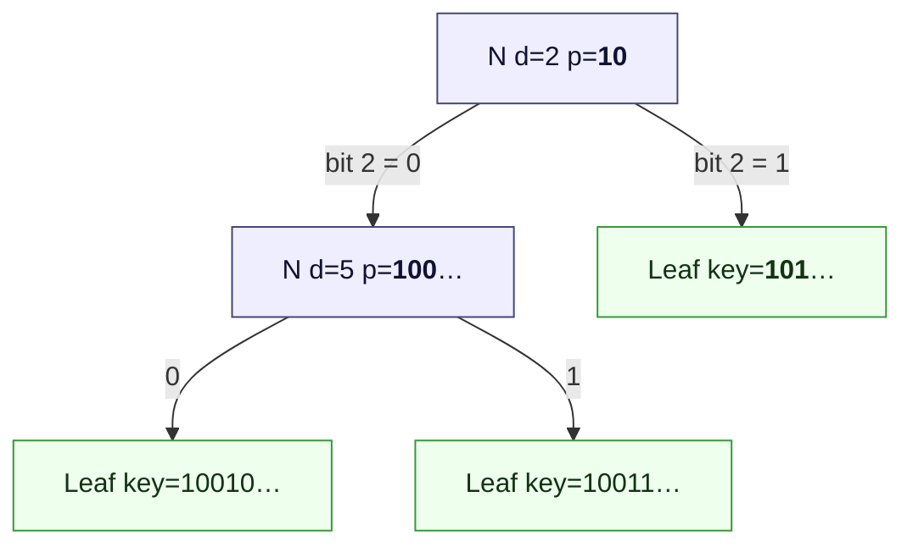
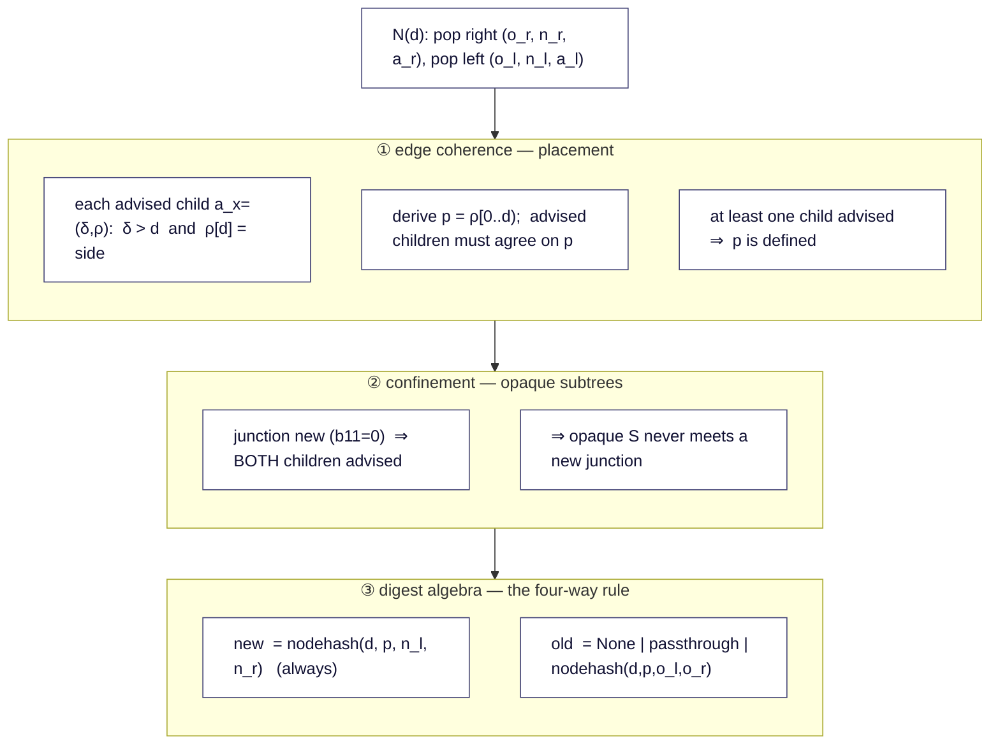
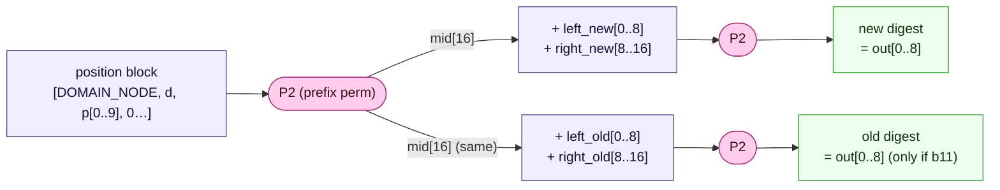
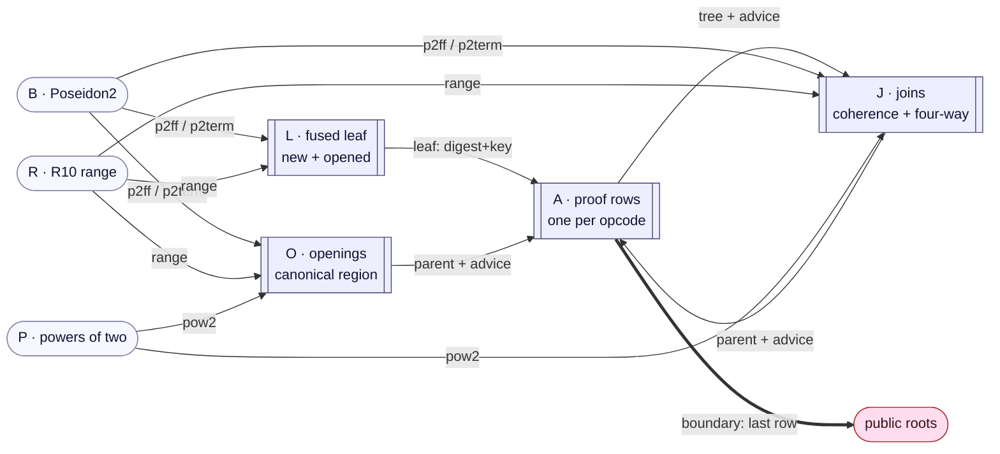
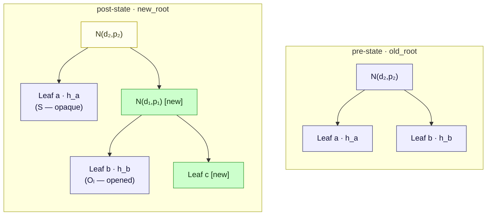
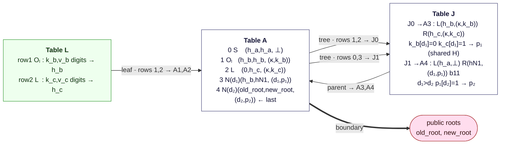

# rsmt-air

Plonky3 AIRs that **arithmetize the consistency-proof verification
algorithm** of the RSMT sparse Merkle tree -- the trusted data structure
behind the Unicity Aggregator. A single STARK binds two public 8-limb
BabyBear digests, `old_root` and `new_root`, certifying that a batch of
insertions was applied correctly between them. The batch and the
consistency-proof stream are **private** inputs; the verifier accepts on
the public roots alone.

The scope of this repository is the zk side: AIR table design, constraint
completeness, lookup-bus soundness, and prover performance. The
verification algorithm itself -- what it guarantees about the tree and why
-- is specified and proven elsewhere: the aggregation-layer paper
(Sections *Stack-Machine Verification* / *Formal Model* / *Security
Theorem*) and the executable reference `ndsmt-experiments/rsmt6a.py`.
Here it is treated as the given spec; the AIR's job is to prove that it
*was executed*, on private inputs, with the public roots as its outcome.

---

> ## R3 pipeline — orientation
>
> The production arithmetization is the **R3** seven-table set **`A/B/L/J/O/R/P`**
> (reduced A, Poseidon2 B, fused-leaf L, join J, opening O, range R, powers P),
> described in the sections below. It replaced a pre-R3 `A/B/C/D/R/F/P` build; the
> R3 improvements are byte-faithful `Value32` leaves (S4), range-checked canonical
> opened regions (S5), an occurrence-correct permutation arena (completeness), a
> verifier-independent reduced A, a canonical protocol/decoder (`rsmt-protocol`),
> and a balanced no-grinding FRI configuration — all proven end-to-end and
> adversarially validated.
>
> The **authoritative deep specification** lives in [`docs/r3/`](docs/r3/):
> security model, the exact relation + extraction, the append-only theorem and
> new-leaf ordering lemma, the soundness budget, the per-column influence manifest
> with the S1–S12→code map, the measured cost vs baseline, and the M9/M10
> optimization results.
>
> Prove/verify a round via `rsmt_prover::{prove_r3_round, verify_r3_round}`; the
> verifier reconstructs its own preprocessing from the public shape (no prover
> data crosses the boundary).

---

## Background: the statement being arithmetized

### The tree

RSMT is a path-compressed Patricia trie over 256-bit keys. Three node
kinds:

- **Leaf** `(key, value)` -- hashed by a 3-step additive Poseidon2 sponge.
- **Junction `N`** -- an internal bifurcation at **depth `d`** with
  **region `p`**: the `d`-bit key prefix addressing the node. Every key in
  the subtree extends `p`; `p‖0` goes left, `p‖1` goes right. Hashed by a
  2-permutation node sponge over `(DOMAIN_NODE, d, p, left, right)`.
- **Empty subtree** -- a missing branch, digest `None`.

A leaf's region is its full key; its depth is `κ = 256`. **Depth and
region are absolute**: splitting an edge *above* a node changes neither, so
inserting keys never re-hashes an existing node -- an insertion only mints
new leaf and junction hashes. This immutability is what makes the
consistency proof short.



*Every node's region is a prefix of every key beneath it; each junction's
region extends its parent's on the correct side.*

### The verification algorithm

A consistency proof is a flat **post-order** opcode stream. The reference
verifier walks it with a stack of triples `(old_digest, new_digest,
advice)`, where `advice = (depth, region)` describes the top node of a
stacked subtree (or `⊥` for an opaque one). At the end the stack must hold
exactly one triple, `(old_root, new_root, ·)`.

| Op | Meaning | Pops | Pushes |
|---|---|---|---|
| `S(h)` | opaque unchanged subtree | -- | `(h, h, ⊥)` |
| `O(d,p,c_l,c_r)` | unchanged junction, opened one level | -- | `(h, h, (d,p))`, `h = nodehash(d,p,c_l,c_r)` |
| `Oₗ(k,v)` | unchanged leaf, opened | -- | `(h, h, (κ,k))`, `h = leafhash(k,v)` |
| `L` | new leaf, next from sorted batch | -- | `(None, leafhash(k,v), (κ,k))` |
| `N(d)` | junction -- derive `p`, check coherence, join | 2 | `(old, new, (d,p))` |

Two details matter for the arithmetization:

- **`N` carries only the depth.** The region `p` is *derived* from the
  advice of the two children on the stack -- regions never travel in the
  proof stream.
- **Openings (`O`, `Oₗ`) expose the advice of preserved subtrees.** An
  opaque `S` has no advice and is only admissible under a *pre-existing*
  junction; wherever a preserved subtree meets a *new* junction, the
  prover must present its opened form.

The `N(d)` handler combines three rule families:



**③ Four-way old-state rule.** The *new* child digests always exist; the
*old* ones may be `None`. With `b00..b11` indicating which children
existed:

| `b00` | `b01` | `b10` | `b11` | `old` result | junction is |
|:-:|:-:|:-:|:-:|---|---|
| 1 | | | | `None` | new (empty→empty) |
| | 1 | | | `right.old` (passthrough) | new |
| | | 1 | | `left.old` (passthrough) | new |
| | | | 1 | `nodehash(d, p, left.old, right.old)` | pre-existing |

Only the `b11` case hashes on the old side; passthroughs keep add-only
proofs short. A junction is **pre-existing iff `b11 = 1`** -- exactly the
case where an opaque `S` child is admissible.

**Why the coherence rules exist**, in one breath: digest algebra alone
proves that hashes are preserved, but not that new leaves sit where their
keys dictate -- and a misplaced junction lets a malicious operator shadow
an existing key with a new value under a fresh certified root
(cross-round equivocation, i.e. a double-spend enabler). Rules ①-② close
this; the attack, the formal definitions, and the soundness theorems are
provided in the paper ('Unicity Bluepaper') and are reproduced executably
in `ndsmt-experiments/rsmt6a.py`. For this repository :all three rule
families are part of the statement, and the constraints must cover every
one of them.**

### Hashing

**Leaf hash** -- 3-step additive Poseidon2 sponge, rate 8 / capacity 8,
digest = `state[0..8]` after step 2. Keys and values pack as 9×30-bit
BabyBear limbs (limbs 0..7 hold 30 bits, limb 8 holds 16).

```
state ← [0;16]
step 0:  state[0]+=DOMAIN_LEAF; state[1..8]+=key[0..7];        state←P2(state)
step 1:  state[0]+=key[7]; state[1]+=key[8]; state[2..8]+=value[0..6]; state←P2(state)
step 2:  state[0..3]+=value[6..9];                            state←P2(state)
leaf_digest = state[0..8]
```

**Node hash** -- the preimage carries the region and does not fit one
width-16 permutation, so it is a **2-permutation sponge**. The key design
point: the first permutation depends only on the junction's *position*
`(d, p)`, so it is **shared** between the old-side and new-side digests of
the same junction.



Permutation budget per object:

| object | permutations | note |
|---|:-:|---|
| leaf (`L` or `Oₗ`) | 3 | sponge steps |
| new junction | 2 | prefix + one children block |
| pre-existing junction (`b11`) | 3 | prefix **shared**, + two children blocks |
| opening (`O`) | 2 | prefix + one children block |

Region limbs reuse the key packing verbatim -- a leaf's advice region *is*
its key limbs, so every region comparison operates on one uniform 9-limb
representation. Regions are stored **left-aligned and zero-padded** below
bit `d`: one canonical encoding per region.

---

## From stack machine to AIR

R3 arithmetizes the stack machine with **seven AIRs** sharing one
`p3-batch-stark` commitment: `A / B / L / J / O / R / P`. Each opcode is one
**Table A** row; four of the five are *backed* by a helper row that does the real
work and hands back a digest (and advice) over a LogUp bus. The reference
machine's *stack* never appears as a table — instead the advice tuple rides the
tree/parent bus **alongside** the digest pair, so a junction sees its children's
`(depth, region)` in exactly the place the stack machine would, and cannot pair
one row's digest with another's advice because they travel as one tuple.

There is **no batch table**. By the new-leaf ordering lemma
([`docs/r3/03`](docs/r3/03-rsmt-append-only.md)) the `L`-opcode keys are already
strictly increasing in A-row order — forced by post-order topology plus
coherence — so the batch is the extracted `L` subsequence, not a trusted input.

### Which table serves which opcode

| opcode | Table A row | backed by |
|---|---|---|
| `S(h)` | `old = new = h`, no advice | — (self-contained) |
| `O(d,p,c_l,c_r)` | `old = new = digest`, advice `(d, p)` | **O** (canonical opening) |
| `Oₗ(k,v)` | `old = new = digest`, advice `(κ, k)` | **L** (opened leaf) |
| `L` | `old = 0`, `old_is_none = 1`, `new = digest`, advice `(κ, k)` | **L** (new leaf) |
| `N(d)` | parent tuple, advice `(d, region)` | **J** (join coherence) |

### Data flow across all tables



The batch and proof stay private — they live only in committed traces. The
**verifier reconstructs every AIR and its preprocessing from the public shape
alone** (scalar row counts), never consuming a prover object, then checks local
constraints, the public roots, and every LogUp balance
([`docs/r3/02`](docs/r3/02-relation-and-extraction.md), S10).

---

## The tables

Seven AIRs, each padded independently to a power of two ("real" = not a padding
row). The three coherence/leaf tables `A/L/J/O` carry the statement; `B/R/P` are
fixed helpers. Widths below are the realized main-column counts.

### Table A — proof rows (reduced, 33 cols)

One row per opcode. A one-hot selector `(is_s, is_o, is_ol, is_l, is_n)` drives
opcode-specific rules over the digest pair `old[8]/new[8]`, `old_is_none`, the
advice tuple `(delta, rho[9])`, and `subtree_start`. Compared with the legacy
Table A it **drops four columns** — `batch_idx`, `opened_idx`, `has_advice`, and
`node_hash_old_needed`: leaves/openings bind to A by **row index** (the bus
keys), `has_advice` is the derived expression `1 − is_s`, and `b11` is derived by
Table J. This is what makes A **verifier-independent** — nothing is round-tripped
that the verifier cannot recompute.

**Local constraints.** Selector booleanity + one-hot; `S/O/Oₗ ⇒ old = new`;
`L ⇒ old = 0 ∧ old_is_none = 1`; `S ⇒ delta = 0 ∧ rho = 0`; `L/Oₗ ⇒ delta = κ`
(256); base-opcode `subtree_start = row_idx`, root `subtree_start = 0`; padding
rows syntactically zero. **Boundary:** the last real row's `(old, new)` equals
the public `(old_root, new_root)` and its `old_is_none` equals the public
`old_root_is_none` (17 public values — genesis `None` vs `Some[0;8]`, S1). Max
local degree **2**.

### Table L — fused canonical leaf (93 cols)

One row per `L` or `Oₗ`, replacing the old three-row leaf sponge (**C**) *and* the
batch/canonical-digit table (**D**). Columns: `a_row_idx`, `key_digits[26]`,
`value_digits[26]`, `mid_0[16]`, `mid_1[16]`, `digest[8]`. The nine key and value
limbs are **linear expressions** `Σ dᵢ·1024ⁱ` in the 26 radix-1024 digits — never
stored columns — and each digit is range-checked at its fixed width against
Table R. That range check makes the reconstruction injective to **exactly 32
bytes** of key and 32 of value (soundness lemma **S4**; this closes the old
`pack_value_32` truncation/aliasing gap). The three leaf-sponge permutations
(steps 0/1 feed-forward to `mid_0`/`mid_1`, step 2 terminal to `digest`) are bound
to Table B on `p2ff`/`p2term`; `digest` + key limbs are sent to A on the `leaf`
bus. Every check rides a bus — the only local rule is padding hygiene.

### Table J — junctions (joins only, 142 cols)

One row per `N`. Carries the R10 coherence block, the four-way old-state, and the
node hash. **Coherence (D13):** a shared prefix `H` with `p[q] = 2·pow_b·H`,
constant side bits (`β_l = 0`, `β_r = 1`), and radix-1024 decompositions of `H`
(`< 2^r`) and each child tail `L_x` (`< 2^k`), so `ρ_l[q] = p[q] + L_l` and
`ρ_r[q] = p[q] + pow_b + L_r`; because both advised children share `p[9]`, "the
derived regions agree" is automatic (**S6**). A one-hot `q` selects the boundary
limb (`depth = limb_start(q) + r_off`), materialized `width_r/width_k` keep the
range tuples degree 1, and `pow_b` is anchored to Table P. **Four-way old state
(S7):** case bits `b00/b01/b10/b11` from the child `None` flags select
`None` / passthrough-right / passthrough-left / `hash_node(old_l, old_r)`; the new
side always re-hashes. Confinement: both children advised for a new junction.
**Node sponge:** the prefix `P2(DOMAIN_NODE, d, p, 0…)` is one `p2ff` receive
(its `mid` feeds both children blocks); the new children block is one `p2term`
receive, the old one more **iff `b11`** — the digest slot *is* `parent_new`/
`parent_old`, binding the propagated digest to a real permutation. Max degree
**3**.

### Table O — openings (canonical region, 89 cols)

One row per `O`, split out of the old union table so an opening pays opening
width, not join width — and, crucially, **range-checks the opened region**, which
the union table never did. Columns: `a_row_idx`, `depth`, `region_digits[26]`,
one-hot `q[9]`, `r_off`, `pow_b`, `H`-digits, `left/right_digest[8]`,
`prefix_mid[16]`, `digest[8]`. Local boundary constraints make the region a
**genuine left-aligned `depth`-bit prefix** (**S5**): the boundary limb
`region[q] = 2·pow_b·H` with `H < 2^r_off`, all limbs below `q` zero, and every
full prefix limb a canonical 30/16-bit integer via its range-checked digits.
`depth < 256` is enforced by the pow2 exponent, so no separate depth check is
needed. The node prefix (`p2ff`) and children block (`p2term`) hash the
reconstructed region; the parent tuple is sent to A. Depths `0/239/240/255` have
dedicated tests. Max degree **3**.

### Helper tables B, R, P

- **B — Poseidon2.** `VectorizedPoseidon2Air` over the occurrence-correct
  permutation plan, 8 lanes per row (dominant width ~2384). Each real perm is
  one occurrence (**no deduplication** — completeness lemma S8); the plan is
  segmented feed-forward-then-terminal, and B *sends* the full
  `(input[16] ‖ output[16])` on **`p2ff`** and `(input[16] ‖ output[0..8])` on
  **`p2term`**, with the ff/term masks derived from the scalar counts
  `(n_ff, n_term)` — no `Vec<bool>` in the public shape. The sole source of truth
  that every in-circuit "hash" is a genuine Poseidon2 evaluation.
- **R — R10 range.** `{(bits, value) : 0 ≤ bits ≤ 10, value < 2^bits}` — 2047
  real rows + a padding row, with a multiplicity column. One `range` bus serves
  L's 52 key/value digits, J's depth/`H`/tail/gap, and O's region/`H` digits.
  `mult` is locally free, fixed by LogUp balance (**S9**).
- **P — powers of two.** 31 rows `(r, 2^r)`, `r ∈ [0,30]`; the `pow2` bus serves
  the coherence/boundary power `pow_b = 2^{W−r−1}` for J and O.

---

## LogUp buses

Seven global buses (Bus 2 is realized as two — `p2ff` + `p2term`), one
extension-field aux column per AIR per tuple; per-bus challenges
`(α, β) ∈ 𝔽_{p⁴}` sampled after the main commitment. **One entry per context** —
the two-entry pairing optimization was gated out
([`docs/r3/08`](docs/r3/08-m9-logup-pairing.md)).

| name | tuple | sender → receiver |
|---|---|---|
| `tree` | `(row_idx, subtree_start, old[8], new[8], old_none, has=1−is_s, delta, rho[9])` | A non-last rows → J children |
| `p2ff` | `(input[16], output[16])` | B feed-forward → L steps 0/1, J/O prefix |
| `p2term` | `(input[16], output[0..8])` | B terminal → L step 2, J/O children |
| `parent` | `(row_idx, old[8], new[8], old_none, delta, rho[9], subtree_start)` | J/O → A `N`/`O` rows |
| `leaf` | `(row_idx, digest[8], key[9])` | L → A `L`/`Oₗ` rows |
| `range` | `(bits, value)` | R → L/J/O digits, depths, gaps |
| `pow2` | `(r, 2^r)` | P → J/O boundary powers |

The `parent` tuple **drops** the legacy `nhon` field (J derives `b11` itself), and
there is **no `batch` bus** (no batch table). Why the set closes the statement:

- **`tree` + `subtree_start`** ⇒ a contiguous post-order tree (S2): the right
  child is `parent−1`, the left `rs−1`, each `N` inherits its left child's start,
  the root's start is `0`. Child indices strictly decrease and `tree` balance
  gives each non-root in-degree 1, so the parent relation is acyclic and spanning
  — one genuine tree, proved by algebra with **no Poseidon fixed-point
  assumption**. The advice fields put `(depth, region)` in the same multiset, so
  a junction cannot invent its children's advice (S3).
- **`parent`** binds each `N`/`O` row to exactly one J/O row — digest, advice, and
  `subtree_start` together (S3).
- **`leaf`** binds each `L`/`Oₗ` row to one L row — digest **and** key limbs — so
  `rho = key` advice is grounded in the run that produced the digest (S4).
- **`p2ff`/`p2term`** force every sponge block and leaf step to be a real
  Poseidon2; the terminal split binds each propagated digest to a real output
  without carrying its capacity tail (S8).
- **`range` + `pow2`** make the region comparisons and inputs sound: every digit,
  depth, gap, and canonical key/value/region limb bounded, coherence/boundary
  powers anchored (S5/S6/S9).

The chain `L → leaf → A → boundary` (with `J/O → parent → A`) is the proof that a
canonical private batch produced the public transition. The verifier never sees
it.

---

## Worked example

Insert one leaf `c` that splits the edge above `b`, into a two-leaf tree.
Honest proof: `S(h_a), Oₗ(k_b,v_b), L, N(d₁), N(d₂)`. Note `b` sits under
the *new* junction `N(d₁)`, so it is **opened**; `a` stays under the
*pre-existing* `N(d₂)` and remains an opaque `S`.



Stack-machine trace (advice shown; `p₁ = k_b[0..d₁) = k_c[0..d₁)`,
`k_b[d₁]=0`, `k_c[d₁]=1`):

```
S(h_a)        push (h_a, h_a, ⊥)                    ; opaque; legal under b11 below
Oₗ(k_b,v_b)   push (h_b, h_b, (κ,k_b))              ; opened preserved leaf
L             push (None, h_c, (κ,k_c))             ; h_c = leafhash(pop batch)
N(d₁)         children advised (required: new)      ; k_b[d₁]=0, k_c[d₁]=1
              p₁ = k_b[0..d₁) = k_c[0..d₁)          ; regions agree
              push (h_b, nodehash(d₁,p₁,h_b,h_c), (d₁,p₁))   ; old = h_b (b10)
N(d₂)         right advised: d₁>d₂, p₁[d₂]=1; p₂=p₁[0..d₂)
              old = nodehash(d₂,p₂,h_a,h_b) = old_root
              new = nodehash(d₂,p₂,h_a,hN1) = new_root
              push (old_root, new_root, (d₂,p₂))
```

Same round as R3 AIR rows (B, R, P omitted):



- J0 is a **new** junction: confinement makes `b` open (`Oₗ`), so both
  children carry advice; coherence derives `p₁` from `k_b`/`k_c` (one shared
  prefix `H`) and forces the split bit. J1 is **`b11`**, so the opaque `S(h_a)`
  on its left is legal, and `p₂` is grounded by chaining the old side to
  `old_root`.
- Leaf `c` needs no batch table: it is the last `L` key in A-row order (Lemma B).
  The zk verifier sees only the two public roots; the bus chain ties L's private
  `(k_c, v_c)` to the boundary on A row 4.

---

## Security of the arithmetization

The security question *of this repository* is faithfulness:

> A STARK proof verifies **iff** there exist private inputs `(π, B)` on
> which the reference verifier accepts `(π, old_root, new_root, B)`.

Soundness is the ⇒ direction: any committed traces satisfying every local
constraint and every LogUp balance encode an accepting run. Completeness
is the ⇐ direction: the witness generator turns every accepting run into a
satisfiable trace. What an accepting run *means* for the tree (append-only
consistency, unicity, ...) is the paper's theorem, consumed here as given.

### Assumptions

1. **STARK layer.** `p3-uni-stark` quotient evaluation + `TwoAdicFriPcs`
   low-degree test + Fiat–Shamir compose to a sound argument of knowledge
   (~116 conjectured bits at the default config).
2. **LogUp.** Per-bus challenges in `𝔽_{p⁴}` (`≈2^124`), sampled after the
   main commitment: multiset error `≤ Σ padded_height / |𝔽_{p⁴}|`, below
   `2^-100` in the parameter range used here.
3. **Upstream Poseidon2 AIR.** `p3-poseidon2-air`'s constraints accept
   exactly genuine Poseidon2(BabyBear, width 16) evaluations per lane.
4. **Public statement.** The verifier knows `(old_root, new_root)`,
   `old_root_is_none`, and the scalar shape; it **reconstructs every AIR and its
   entire preprocessing commitment from that shape alone** — no prover object
   crosses the boundary (S10, verifier-independence).

Notably, hash *collision resistance* is not on this list -- the
arithmetization is faithful regardless; collision resistance enters one
level up, where the paper interprets accepting runs as tree facts. (Since
D19, the tree-shape argument no longer borrows a Poseidon fixed-point
assumption either — see the functional-graph note under *pitfalls*.)

### Rule-by-rule constraint coverage

Every rule of the reference verifier (`rsmt6a.verify_consistency`) must be
covered by a constraint or a bus balance -- this table is the checklist:

| reference-verifier rule | AIR mechanism |
|---|---|
| `S(c)` pushes `(c, c, ⊥)` | A: `is_s ⇒ old = new`, no-advice shape |
| `O` hashes its opening | O row: canonical region + node sponge on `p2ff`/`p2term`; digest + `(d′,p′)` returned on `parent` |
| `Oₗ` / `L` hash a leaf | L row: 26 range-checked digits reconstruct the key/value, sponge on `p2ff`/`p2term`; digest + key on `leaf` |
| `L` consumes next batch element | extracted, not consumed: the `L`-key subsequence is strictly increasing in A-row order (topology + coherence, Lemma B) — no batch table |
| `N` pops two children | `tree` multiset (each non-last A row consumed exactly once) + `subtree_start` chain (right = `parent−1`, left = `rs−1`, root start `0`) ⇒ contiguous post-order shape |
| advice is what the child pushed | advice fields ride `tree`/`parent`/`leaf` *with* the digest — no mix-and-match |
| `δ > d` per advised child | depth-gap `(8, gap)` receive on the `range` bus |
| `ρ[d] = β` per advised child | boundary-limb R10 decomposition (`pow2` power + `range` digits) |
| key/value limbs are byte-canonical | Table L radix-1024 digit reconstruction + `range` receives (`< 2^30`) |
| `p = ρ[0..d)`, children agree | both children constrain the same `p[9]` columns |
| `p` defined (≥1 advised) | `(1 − has_l)(1 − has_r) = 0` |
| new junction ⇒ both advised | `(1 − b11)(2 − has_l − has_r) = 0` |
| four-way old-state rule | J local case constraints + `p2term` for the `b11` hash |
| `new = nodehash(d, p, n_l, n_r)` | prefix + children blocks on Bus 2 |
| stack ends with one entry | boundary on the unique `is_last_real` row; every other real row sent on Bus 1 and consumed |
| final entry = `(old_root, new_root)` | boundary constraints against public values |
| proof + batch fully consumed | bus balances: unconsumed sends / receives unbalance LogUp |
| batch strictly sorted, keys distinct | **not in-circuit** -- see scope notes |

### Arithmetization pitfalls (why the non-obvious constraints exist)

These are the spots where a missing constraint would break soundness even
though the "happy path" works -- each is a required negative test:

- **Digest truncation (tagged Bus 2).** A digest is 8 of 16 permutation
  output limbs. A *feed-forward* output (a node prefix, a non-final leaf
  step) is another block's input, so its full 16 limbs must be bound —
  carried on `p2ff`. A *terminal* output is used only as a digest, so it is
  carried on `p2term` as 8 limbs and the digest slot is the very column that
  propagates (`parent_new`/`parent_old`, or the leaf digest). Splitting the
  bus (rather than masking a tail) keeps every tuple degree 1 and leaves no
  unbound tail that could satisfy the bus without a permutation behind it.
- **Advice–digest co-travel.** If advice moved on its own bus, a prover
  could pair row X's digest with row Y's advice. One tuple per bus, digest
  and advice together, everywhere (Buses 1, 3, 4).
- **Padding hygiene.** Padding rows must be syntactically zero (and Table
  B's padding lanes are real `P2([0;16])` evaluations with bus
  multiplicity masked to zero) -- otherwise padding contributes spurious
  bus sends.
- **One-hot selectors.** Opcode and case bits must be boolean *and*
  mutually exclusive; a row that is "half `L`, half `N`" bypasses both
  rule sets.
- **Unique sender keys.** Bus 1 soundness leans on `row_idx` being a
  preprocessed (verifier-fixed) column: multiset balance + unique keys ⇒
  each row consumed exactly once. Same pattern for C's `leaf_idx`.
- **Canonical region encoding.** Regions must be zero-padded below bit
  `d` wherever they enter a hash (join rows by the coherence block,
  opening rows by an explicit padding check) -- two encodings of one
  region would break digest determinism.
- **Canonical inputs.** Key/value field limbs must be range-checked to their
  byte widths (`< 2^30`, top limb `< 2^16`) via Table L's digit
  reconstruction — otherwise a prover commits a non-canonical field limb that
  still hashes, forging a leaf preimage that no byte-encoded key produces.
- **Range side-conditions.** `L`, `H` of the boundary-limb R10 split must be
  range-bounded or the decomposition is ambiguous; depths must be bytes or
  the one-hot/offset split of `d` is ambiguous.
- **Functional-graph corner (closed by D19).** With the old free `left_ptr`,
  Bus 1 closure made the parent-child structure a functional graph with one
  sink, but a disjoint cycle whose digests happen to close under the buses
  was not excluded *syntactically* — it needed a Poseidon2 fixed-point to be
  ruled out. The `subtree_start` chain now excludes it algebraically: child
  indices strictly decrease (right = `parent−1`, left = `rs−1`) so the parent
  relation is acyclic, and the root's start `= 0` forces a single spanning
  tree. No cryptographic assumption is borrowed here anymore.

### Trace-tamper test matrix

Constraint coverage is only believable with negative tests. Each test
perturbs a *verifying* trace post-build and asserts proving or verification
fails (a violated constraint surfaces as a prover-side `check_constraints`
panic or a `verify_batch` error — either is a rejection). Two layers exist:
the per-table `check_constraints` negatives in `rsmt-air`, and the
end-to-end sweep in `rsmt-prover::tamper` (M5), which runs a full round
through `prove_batch`/`verify_batch`. Together they touch every bus and
every local constraint family:

| family | tamper |
|---|---|
| tree shape (D19) | swap children; corrupt a base row's `subtree_start`; corrupt a join's `ls`/`rs` |
| digest algebra | break a passthrough; forge `old_is_none`; scramble an A digest; forge `parent_new` (bound by `p2term`); tamper a feed-forward `mid` limb |
| coherence | flip a bit of derived `p`; flip advice `rho` in transit; `δ ≤ d`; out-of-range `L`/`H` digits; break `p`'s zero-padding; drop advice under a new junction (the reference shadow-insertion vector) |
| inputs | non-canonical key/value limb (Table L digit reconstruction / range) |
| kind/advice binding | opened digest consumed by `L`; batch digest consumed by `Oₗ`; one row's digest with another's advice |
| helpers | inflate a Table R (range) multiplicity; inflate a Table P (pow2) multiplicity |

### Scope notes

- **Tree-level meaning** of an accepting run -- append-only consistency,
  canonical placement, unicity across rounds -- is proven in the
  aggregation-layer paper and exercised in `ndsmt-experiments/rsmt6a.py`.
  This repo inherits, and must not weaken, the statement; it adds nothing
  to it.
- **Batch sortedness / distinctness** is not checked in-circuit. It is
  provably redundant for soundness (duplicate keys make the coherence
  constraints unsatisfiable; sort order only fixes the prover's own
  assignment of batch rows to `L` positions) -- external sort/dedup is a
  completeness convenience of the witness generator.
- **Empty pre-state / empty batch.** Genesis pins the canonical `None`
  digest at the boundary; the empty-batch identity transition is handled
  by the caller, not this AIR.
- **Zero-knowledge.** The default FRI config is succinct but not zk:
  private inputs live in unmasked committed traces. For zk, use
  `FriParameters::new_benchmark_zk` with masking columns -- out of scope
  (the goal is verifier work reduction, not input privacy).

---

## Cost projection

Table B (Poseidon2) dominates cell count — its per-row main width (≈2384 =
`P2_PERM_WIDTH × 8` lanes) is the arithmetic cost of a genuine permutation and
dwarfs every logical table (the widest of those is J at **142**; L is 93, O is
89, A is 33). Because B is inherent and unchanged, R3 costs essentially the same
as the pre-R3 pipeline while being sound: at prefill 1024 / batch 64, total
committed cells fell ~3 % (B-dominated) but **leaf work dropped ~64 %** (the old
C+D's ~33.9 k cells → L's ~12 k) and the non-B tables ~17 %, with prove+verify
unchanged. Measured numbers and the baseline comparison are in
[`docs/r3/07`](docs/r3/07-r3-cost.md). Committed cells grow ~linearly in the
batch size (the `rsmt-bench perf` sweep confirms this).

---

## Parameter choice — balancing four axes

Proving time is **not** the only goal: a production configuration balances
**security bits, proof size, proving time, and recursion friendliness**, with
simple parameters. The M10 FRI grid ([`docs/r3/09`](docs/r3/09-m10-fri-grid.md))
settled on **`log_blowup = 2` (rate ¼), 64 queries, no grinding** — the frozen
`R3_FRI`:

- **128 conjectured bits** — a clean power-of-two query count, comfortable margin;
- **no grinding** — a PoW loop is very expensive to re-run in a recursive
  verifier, and it earns nothing on any other axis;
- **only 64 query openings** — half the in-circuit Merkle work of a rate-½
  config, the dominant recursion cost;
- **~1.3 MB proof, ~67 ms verify** — the smallest/fastest tier.

The one cost is prover time (rate ¼ doubles the LDE, ~+40 %), a one-time prover
expense — while proof size, verify time, query count, and grinding-freedom all
help every downstream and recursive verifier. `(log_blowup = 1, 116 queries, 0
PoW)` is the documented alternative when prover throughput is the priority.

---

## Performance harness

`rsmt-bench` runs prove + verify across batch sizes and FRI parameters (via
`prove_r3_round` / `verify_r3_round`), reporting per-table cell counts and
timings.

```bash
cargo build --workspace --release
./target/release/rsmt-bench perf --prefill 100000 --batches 256,1024
```

`perf` flags: `--batches`, `--prefill`, `--seed`, `--log-blowup` (FRI LDE
rate), `--num-queries`, `--query-pow-bits` (grinding), `--max-log-arity`
(FRI folding), `--hash` (`poseidon2` / `sha256` / `blake3` / `all`). The
header prints conjectured soundness bits per the ethSTARK heuristic
`log_blowup × num_queries + query_pow_bits`.

Output columns:

```
batch  L  N  B_perms  cells  maxW  wit_ms  prove_ms  verify_ms  proof_KB
```

Other subcommands: `smt` (pure-CPU verify, no STARK) and `round` (a single
measured round with the full per-table real/padded/main/prep/cells
breakdown, timings, and proof size).

### Proving-hash selection

The FRI/Merkle/Fiat–Shamir layer hashes internally, independent of the
in-circuit tree hash (always Poseidon2). Use `poseidon2` when the proof
will be recursively verified in a field-friendly circuit (e.g. the SP1
aggregation of the paper); use `sha256`/`blake3` for a fast final native
verify. On the structural predecessor, Blake3 FRI gave ~3× faster verify
at equal prove time -- the same trade is expected here.
